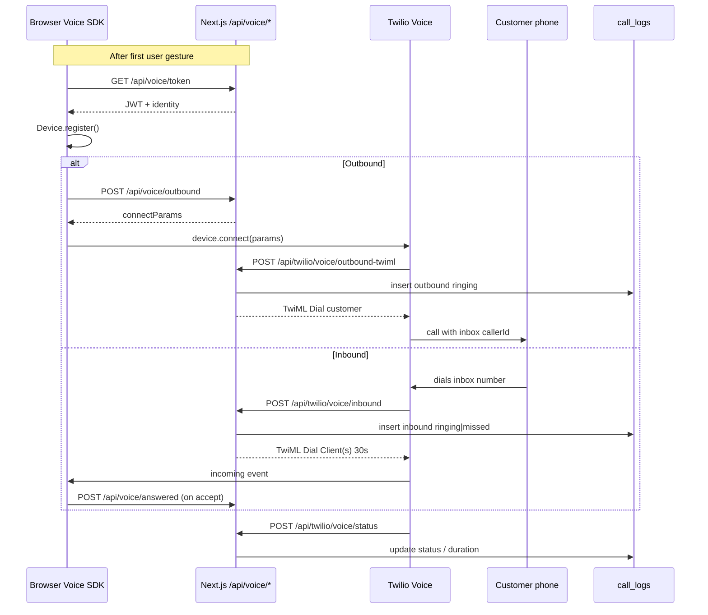
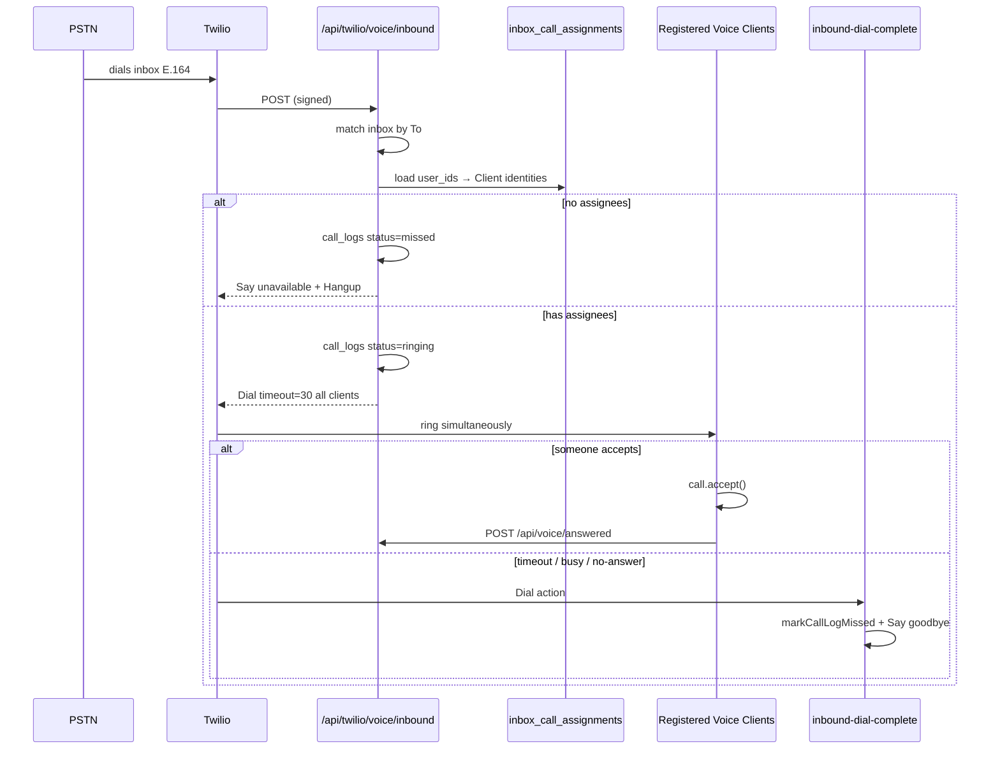

# Calls flow

Precise reference for **Twilio Programmable Voice** (browser/agent phone calls) on the TAV web app — outbound from a thread, inbound ringing, call history, and missed badges.

**Not covered here:** chat voice notes or inbox MMS audio → [`voice-messaging-sending-flow.md`](./voice-messaging-sending-flow.md).

**Shorter skeleton:** [`flows/08-voice-calls.md`](../flows/08-voice-calls.md) — high-level summary. **This document is the detailed source of truth** for mobile implementation, verified against web `master` (including commit `300db54` — voice enabled on all inboxes with Twilio numbers). Ops routing detail may still live in web-repo planning docs (e.g. `planning/NEXT_STEPS.md`) that are not mirrored here.

**Mobile plan:** Phase 12 in [`IMPLEMENTATION_PLAN.md`](../IMPLEMENTATION_PLAN.md).

---

## Product scope (current prod / code)

| Capability | Code today | Ops / Console today |
|---|---|---|
| **Outbound Call button** | Any inbox with `twilio_phone_e164` (`isVoiceEnabledInbox`) | Works wherever the line can place PSTN calls |
| **Inbound ringing** | Any inbox that has Voice webhook → `/api/twilio/voice/inbound` **and** rows in `inbox_call_assignments` | **Pilot intent:** Transportation QA `+17435000019` only; other lines still on Twilio demo welcome URL until ops rollout |
| **Assignee admin UI** | Dev console only, **scoped to Transportation QA** | Operators manage ring list there |
| **Call history `/calls`** | All approved users; lists **all** `call_logs` (limit 200) | — |
| **Missed badge** | Nav “Calls” link; counts **all** missed inbound since last-seen | Naming still says “pilot” in API paths |

**Pilot constants** (`web/lib/voice/pilot-inbox.ts`):

| Constant | Value |
|---|---|
| `PILOT_VOICE_INBOX_SLUG` | `transportation-qa` |
| `PILOT_VOICE_DISPLAY_NAME` | `Transportation QA` |
| `PILOT_VOICE_PHONE_E164` | `+17435000019` |

---

## Architecture overview



---

## Outbound from a thread

### User steps

1. Open a **direct** (1:1) thread on an inbox that has a Twilio number.
2. After any page gesture, Voice Device initializes (see [Device lifecycle](#device-lifecycle-web)).
3. Tap **Call** (`ThreadVoiceCallControls`).
4. Browser prompts for **microphone** (if not already granted).
5. UI shows **Calling…** → then elapsed timer when connected.
6. **Mute** / **Hang up** available in-call.
7. Disconnect ends the call; controls return to idle Call button.

### UI gates

Shown only when all are true (`inbox-messenger.tsx` + `ThreadVoiceCallControls`):

- `thread_kind === "direct"`
- `customer_e164` present
- `isVoiceEnabledInbox(selectedInbox)` → `twilio_phone_e164` set

Disabled when: Device still initializing / error, mic denied or unsupported, or already in a call / incoming ring.

### Exact API sequence

```
GET  /api/voice/token          → Device.register()     (once after gesture)
POST /api/voice/outbound       → { connectParams }
device.connect({ params })
POST /api/twilio/voice/outbound-twiml   (Twilio → app; signature-validated)
POST /api/twilio/voice/status          (when statusCallback URLs resolve)
```

`/api/voice/answered` is **inbound-only** (not used on outbound).

### Request / response bodies (native-relevant)

#### `GET` or `POST /api/voice/token`

Auth: approved user (cookie **or** `Authorization: Bearer <supabase_access_token>`).

**200:**

```json
{
  "token": "<twilio-access-token-jwt>",
  "identity": "<32-hex-user-id>",
  "expiresIn": 3600
}
```

**500** (misconfig):

```json
{
  "error": "<message>",
  "hint": "Set TWILIO_API_KEY_SID, TWILIO_API_KEY_SECRET, and TWILIO_TWIML_APP_SID on the server."
}
```

Token grants: `outgoingApplicationSid` = TwiML App; `incomingAllow: true`.  
Identity = profile UUID with hyphens stripped (`voiceClientIdentityForUser`).

#### `POST /api/voice/outbound`

```json
{
  "thread_id": "<uuid>",
  "inbox_id": "<uuid>",
  "customer_e164": "+E164"
}
```

If `thread_id` is set, server loads the thread and **overrides** `inbox_id` / `customer_e164` from DB (still useful for client UX to send all three).

**200:**

```json
{
  "connectParams": {
    "To": "+E164",
    "inboxId": "<uuid>",
    "threadId": "<uuid>"
  }
}
```

`threadId` is omitted from `connectParams` when the request had no `thread_id`.

**Errors (message strings matter for UI):**

| Status | `error` |
|---|---|
| 400 | `Invalid JSON body` |
| 400 | `Invalid thread_id` |
| 404 | `Thread not found` |
| 400 | `Calls are only supported on direct 1:1 threads` |
| 400 | `Thread has no valid customer phone number` |
| 400 | `inbox_id is required (or pass thread_id)` |
| 400 | `customer_e164 must be valid E.164 (+…)` |
| 403 | `Forbidden` |
| 400 | `This inbox has no voice line configured` |

#### Outbound TwiML (`POST /api/twilio/voice/outbound-twiml`)

Twilio Client connect params become webhook form fields (`To`, `inboxId`, `threadId`, `From` = `client:<identity>`).

Server:

1. Validates `To` E.164 + `inboxId`
2. Loads inbox `twilio_phone_e164` as **callerId**
3. Resolves `agent_user_id` from Client identity; `thread_id` from param or `resolveDirectThreadId`
4. Inserts `call_logs` (`direction: outbound`, `status: ringing`, `agent_user_id` set)
5. Returns `<Dial callerId="…" answerOnBridge="true"><Number>…</Number></Dial>`

### In-call controls

| Control | Web | Notes |
|---|---|---|
| Mute / unmute | Yes | `call.mute()` |
| Hang up | Yes | `call.disconnect()` |
| Elapsed timer | Yes | Starts on `accept` event; `formatVoiceElapsed` |
| DTMF keypad | **No** | Not implemented in `use-twilio-voice` |
| Hold / transfer / conference | **No** | — |

### Constraints

| Constraint | Enforcement |
|---|---|
| Direct 1:1 only | API 400 + UI hides Call on groups |
| Send access | `userCanSendInbox` → 403 |
| Live Twilio number | Inbox must have `twilio_phone_e164` |
| One active call | Client throws `Already on a call` if `callRef` set or `phase === "incoming"` |
| Mic required | `ensureMicrophoneAccess` before connect |

---

## Inbound ringing

### Customer dials → agents ring



**Important:** ringing is a **simultaneous ring group**, not a sequential cascade. All assignees in `inbox_call_assignments` for that inbox are dialed together (`dial.client(identity)` for each). Timeout **30 seconds**.

Unavailable TTS (exact):  
`Sorry, no one is available to take your call right now. Goodbye.` (voice `alice`).

### Accept / decline / timeout

| Action | Behavior |
|---|---|
| **Accept** | Mic prompt → `call.accept()` → `POST /api/voice/answered` `{ "call_sid": "CA…" }` → sets `agent_user_id` + `status: in-progress` **only if** user is in `inbox_call_assignments` for that inbox |
| **Decline** | `call.reject()` → UI back to `ready` |
| **Already on a call** | New incoming auto-`reject()` (no modal) |
| **Dial timeout / no-answer / busy / failed / canceled** | `inbound-dial-complete` → `markCallLogMissed`; customer hears unavailable message |
| **Status callback** | May also map inbound no-answer/busy/failed dial → stored **`missed`** |

#### `POST /api/voice/answered`

```json
{ "call_sid": "CA…" }
```

**200:** `{ "ok": true }`  
**404** Call not found · **400** Not an inbound call · **403** Forbidden (not assigned) · **400** `call_sid is required`

### Device lifecycle (web)

| Topic | Behavior |
|---|---|
| Where | Hook runs inside **inbox messenger** (`useTwilioVoice`), not a global workspace shell alone |
| When enabled | After first `pointerdown` / `keydown` on the page (`voiceUserGestureOccurred`), and **not** while the initial developer-dashboard overlay is showing |
| Why gesture | Avoids minting token + opening Voice websocket on cold load |
| Init | `GET /api/voice/token` → `new Device(token, { closeProtection: true })` → `register()` |
| Keep-alive | Device stays registered while the inbox page effect is active and `enabled` stays true |
| Tab closed / navigate away | Effect cleanup: `call.disconnect()`, `device.destroy()` — **inbound will not ring** that browser session |
| Background tab | Device may keep websocket briefly; OS/browser may throttle. **Not** a reliable “always ring” path; no service worker Voice handling |
| Token refresh | **None.** TTL **3600s**. No `device.updateToken`. After ~1h expect Device errors until remount / re-enable |

Phases: `uninitialized` → `initializing` → `ready` | `incoming` | `connecting` | `in-call` | `error`.

Incoming UI: `IncomingVoiceCallModal` (Accept / Decline + mic warning).

---

## Call history & badges

### Who sees what

| Surface | Who | Data |
|---|---|---|
| `/calls` | All **approved** messaging users | Up to **200** newest `call_logs` (all inboxes the query returns; SSR via service role + `listPilotCallLogs`) |
| Row visibility (RLS) | Inbox members / access | `user_can_access_inbox(inbox_id)` for client scoped reads |
| Thread deep link | Same | If `thread_id` set → `/inbox?inbox={inbox_id}&thread={thread_id}` |
| Missed nav badge | Approved users (polled from client context) | Unseen missed inbound since localStorage last-seen |
| Assignments editor | **Dashboard operators** only | Transportation QA pilot inbox |

Despite the name `listPilotCallLogs` / `voice-pilot/*`, history and missed-count queries are **not** filtered to the pilot phone in code.

### Data source

`listPilotCallLogs(service, 200)` selects from `call_logs` ordered by `started_at` desc, joining inbox display name + agent profile.

### Missed count API

`GET /api/dev-console/voice-pilot/missed-count?since=<ISO>`

Auth: `getApprovedApiUser()` (not operator-only).

**Response shape:**

```json
{
  "unseenMissedCount": 0,
  "latestMissed": { /* optional latest missed row metadata */ }
}
```

Statuses counted as missed: `missed` | `no-answer` | `busy` (inbound). Optional `since` filters `started_at`.

### Last-seen (“seen”) behavior

| Key | Storage | Role |
|---|---|---|
| `tav-voice:calls-last-seen-at` | `localStorage` | Passed as `since` for badge; written when user opens `/calls` (`CallsPageTrackSeen`) |
| `tav-voice:notified-missed-call-ids` | `localStorage` (last 50 ids) | Dedupe desktop Notification / toast |

Poll interval: **~90s** + on document visibility (`dev-console-attention-context`). Badge in sidebar `/calls` nav; caps display at `99+`.

Alerts when a new missed call appears: desktop Notification if tab backgrounded + permission; else toast with link to `/calls` if not already there.

---

## Data model

### `call_logs`

| Column | Type / notes |
|---|---|
| `id` | uuid PK |
| `direction` | `inbound` \| `outbound` |
| `inbox_id` | FK `inboxes` NOT NULL |
| `thread_id` | FK `threads`, nullable — set when known direct thread exists or outbound passed `threadId` |
| `customer_e164` | text NOT NULL |
| `agent_user_id` | FK `profiles`, nullable — outbound: from Client identity at TwiML; inbound: set on `/answered` |
| `twilio_call_sid` | text UNIQUE |
| `status` | see below |
| `started_at` | timestamptz |
| `ended_at` | timestamptz nullable |
| `duration_seconds` | int ≥ 0 nullable |
| `created_at` / `updated_at` | timestamptz |

**Writes:** service role from Twilio webhooks + `/api/voice/answered`.  
**Reads:** RLS — approved + `user_can_access_inbox(inbox_id)`.

#### Status meanings

| Status | Meaning |
|---|---|
| `ringing` | Call placed / inbound ringing assignees |
| `in-progress` | Connected (inbound after answered API; also via status callbacks) |
| `completed` | Ended normally |
| `missed` | Inbound: no assignees, dial timed out, or mapped from no-answer/busy/failed dial |
| `failed` | Failed / canceled (Twilio) |
| `busy` | Busy (may still be treated as missed in UI helpers) |
| `no-answer` | No answer (may be remapped to `missed` for inbound) |

`mapTwilioCallStatus`: `queued`/`ringing` → `ringing`; `canceled` → `failed`; unknown → `failed`.

`isMissedInboundStatus`: `missed` \| `no-answer` \| `busy`.

### `inbox_call_assignments`

| Column | Notes |
|---|---|
| `inbox_id` + `user_id` | Composite PK |
| `created_at` | |

Users who receive **inbound Client rings** for that inbox. Non-exclusive (all listed ring together). Service-role writes from dev console API.

### When `thread_id` / `inbox_id` / `agent_user_id` are set

| Field | Outbound | Inbound |
|---|---|---|
| `inbox_id` | From connect params / thread | Matched from dialed `To` |
| `thread_id` | Param or `resolveDirectThreadId(inbox, customer)` | `resolveDirectThreadId` if a direct thread already exists; else null |
| `agent_user_id` | From Client `From` identity at outbound-twiml | Null until `/api/voice/answered`; then answering assignee |

---

## Twilio / env (ops)

### Env vars required for Voice

| Variable | Role |
|---|---|
| `TWILIO_ACCOUNT_SID` | Access token |
| `TWILIO_API_KEY_SID` | API key (`SK…`) |
| `TWILIO_API_KEY_SECRET` | API key secret |
| `TWILIO_TWIML_APP_SID` | TwiML App (`AP…`) for browser outbound |
| `TWILIO_AUTH_TOKEN` | Validate Twilio webhook signatures |
| `TWILIO_WEBHOOK_PUBLIC_URL` | Optional public origin for Dial `action` / `statusCallback` |
| `VERCEL_URL` | Fallback origin if public URL unset |

### Console wiring

| Resource | URL |
|---|---|
| **TwiML App** Voice Request URL | `POST {origin}/api/twilio/voice/outbound-twiml` |
| **Phone number** Voice URL | `POST {origin}/api/twilio/voice/inbound` |
| **Phone number** Status callback | `POST {origin}/api/twilio/voice/status` |
| Dial action (inbound) | `{origin}/api/twilio/voice/inbound-dial-complete` |

### Which numbers have Voice webhooks live today

From web planning notes (**not** re-verified from Console in this doc):

- **Pilot** `+17435000019` (Transportation QA): intended to point at app inbound + status.
- **Other 8 production lines:** still on Twilio **demo welcome** URL until ops rollout.

Code will handle **any** number whose `To` matches an `inboxes.twilio_phone_e164` row once webhooks are pointed at the app and assignees exist.

---

## Edge cases

| Case | Behavior |
|---|---|
| Mic denied | Call button disabled; Accept shows warning; `getMicrophoneDeniedMessage()` |
| Mic unsupported | Call disabled |
| Second outbound while busy | Throws `Already on a call` |
| Second inbound while busy | Auto-reject (silent) |
| User not in ring assignments | Does not receive Client ring; if they somehow call `/answered` → **403** |
| Non-pilot line outbound | **Allowed** if inbox has Twilio number + send access |
| Non-pilot line inbound | Works in code if webhooks + assignments; **admin UI** for assignments is pilot-only |
| No assignees on inbound | Immediate missed + unavailable Say |
| Network drop mid-call | SDK `disconnect`/`error` → UI reset; status webhook should finalize `call_logs` when Twilio notices |
| Token expiry (~1h) | No refresh; Device errors until page re-inits Voice |
| Duplicate `call_sid` insert | Unique violation `23505` treated as success |
| History-only inbox (no number) | No Call button; outbound API 400 |
| Group thread | No Call controls; API 400 |

---

## Mobile-critical gaps

### Product intent (recommended framing)

| Phase | Recommendation |
|---|---|
| **Mobile v1 voice** | **Outbound-only** is a sane first ship: same `/api/voice/token` + `/outbound` + Twilio Voice RN SDK, reuse thread Call button constraints |
| **Inbound on mobile** | Treat as a **hard** follow-on: needs push wake + **CallKit** (iOS) / **ConnectionService** (Android), always-registered identity, and background mic/session rules — web’s “tab must be open” model does **not** translate |

Requires Expo **dev client** + native plugins for real incoming calls (not Expo Go).

### Do existing voice APIs accept Bearer JWT?

**Yes.** `getApprovedApiUser()` resolves:

1. Supabase **auth cookies** (web), else  
2. `Authorization: Bearer <supabase_access_token>` (native)

So `/api/voice/token`, `/api/voice/outbound`, `/api/voice/answered`, and missed-count already match the SMS mobile auth pattern. Web clients currently send cookies only (`credentials: "include"`).

Twilio webhook routes stay signature-auth only (no user JWT).

### Web-only assumptions native cannot reuse

| Assumption | Impact on mobile |
|---|---|
| `@twilio/voice-sdk` browser `Device` | Use **Twilio Voice React Native** (or equivalent), not the web SDK |
| Lazy init after DOM gesture | Replace with app foreground / login lifecycle; still avoid registering too early if battery matters |
| `closeProtection: true` (beforeunload) | N/A — use native call lifecycle |
| Inbound only while inbox page mounted | Mobile needs **global** Voice registration (or push-driven connect) for inbound |
| No token refresh | Native **must** implement refresh before `expiresIn` (3600) — web gap to fix for both |
| Missed badge = `localStorage` | Use AsyncStorage / SecureStore equivalent; consider server-side last-seen later |
| Simultaneous ring assumes registered Clients | Unregistered mobile users will miss inbound even if assigned |
| No DTMF / transfer | Same product limits unless you add them |
| Dev console assignments UI | Mobile can skip; ops stays on web |

### Auth / identity for native

- Mint token with Bearer → register Client as same **32-hex identity** derived from user UUID.
- Keep that identity stable so inbound `dial.client(identity)` still matches `inbox_call_assignments`.

---

## Evidence from web

| Area | Path |
|---|---|
| Voice hook | `web/lib/voice/use-twilio-voice.ts` |
| Token mint | `web/lib/twilio/mint-voice-access-token.ts` |
| Voice env | `web/lib/twilio/voice-config.ts` |
| Identity | `web/lib/voice/client-identity.ts` |
| Pilot / enable helpers | `web/lib/voice/pilot-inbox.ts` |
| Call log writes | `web/lib/voice/call-logs.ts` |
| Status mapping | `web/lib/voice/call-log-status.ts` |
| History list | `web/lib/voice/list-pilot-call-logs.ts` |
| Missed count | `web/lib/voice/count-missed-pilot-calls.ts` |
| Last-seen keys | `web/lib/voice/calls-last-seen.ts` |
| Missed alerts | `web/lib/voice/missed-call-notification.ts` |
| Mic helpers | `web/lib/voice/microphone-permission.ts` |
| API auth (Bearer) | `web/lib/auth/api-session.ts` |
| `GET/POST /api/voice/token` | `web/app/api/voice/token/route.ts` |
| `POST /api/voice/outbound` | `web/app/api/voice/outbound/route.ts` |
| `POST /api/voice/answered` | `web/app/api/voice/answered/route.ts` |
| Inbound TwiML | `web/app/api/twilio/voice/inbound/route.ts` |
| Dial complete | `web/app/api/twilio/voice/inbound-dial-complete/route.ts` |
| Outbound TwiML | `web/app/api/twilio/voice/outbound-twiml/route.ts` |
| Status callback | `web/app/api/twilio/voice/status/route.ts` |
| Assignments API | `web/app/api/dev-console/voice-pilot/call-assignments/route.ts` |
| Missed-count API | `web/app/api/dev-console/voice-pilot/missed-count/route.ts` |
| `/calls` page | `web/app/(workspace)/calls/page.tsx` |
| History table | `web/app/(workspace)/calls/calls-history-panel.tsx` |
| Track seen | `web/app/(workspace)/calls/calls-page-track-seen.tsx` |
| Thread Call UI | `web/components/thread-voice-call-controls.tsx` |
| Incoming modal | `web/components/incoming-voice-call-modal.tsx` |
| Device enable + wire-up | `web/app/inbox/inbox-messenger.tsx` |
| Badge polling | `web/components/dev-console-attention-context.tsx` |
| Assignments UI | `web/app/admin/dashboard/inbox-call-assignments-panel.tsx` |
| SQL | `tools/sql/20260611120000_voice_call_logs.sql` |

---

## Quick reference — routes

| Method | Path | Caller |
|---|---|---|
| GET/POST | `/api/voice/token` | Agent app |
| POST | `/api/voice/outbound` | Agent app |
| POST | `/api/voice/answered` | Agent app (inbound accept) |
| POST | `/api/twilio/voice/outbound-twiml` | Twilio (TwiML App) |
| POST | `/api/twilio/voice/inbound` | Twilio (number Voice URL) |
| POST | `/api/twilio/voice/inbound-dial-complete` | Twilio (Dial action) |
| POST | `/api/twilio/voice/status` | Twilio (status callbacks) |
| GET/PUT | `/api/dev-console/voice-pilot/call-assignments` | Dev console (operators) |
| GET | `/api/dev-console/voice-pilot/missed-count` | Nav badge |
