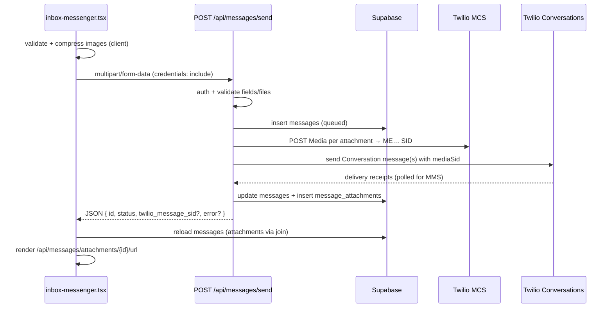

# Image / MMS outbound send flow

Precise reference for how the **web inbox** sends images and other MMS attachments. This document focuses on the **send path** from browser → API → Twilio → database → display. It does not cover general MMS carrier theory.

**Primary UI:** `web/app/inbox/inbox-messenger.tsx`  
**Primary API:** `POST /api/messages/send` (`web/app/api/messages/send/route.ts`)  
**Runtime:** Node.js (`export const runtime = "nodejs"`)

---

## End-to-end send path



**Twilio path in production:** Conversations + MCS (`ME…` media SIDs).  
**Not used by the live web send path:** `send-direct-1to1-sms.ts` (Programmable Messaging `messages.create` + Supabase `outbound-mms` signed URLs). That module exists but has **no callers**.

---

## API endpoint

| Property | Value |
|---|---|
| Method | `POST` |
| Path | `/api/messages/send` |
| Handler | `web/app/api/messages/send/route.ts` |
| `GET` | `405` `{ "error": "Method not allowed" }` |

### Routing inside the handler

After auth and validation, the handler branches on `thread_id`:

| Condition | Handler | Use case |
|---|---|---|
| `thread_id` is a valid UUID | `executeOutboundToExistingGroupThread` | `app_group` or `group_mms` thread |
| No `thread_id` (or empty) | `sendDirect1To1ViaConversations` | Direct 1:1 to `to` |

Both paths require a valid **Conversations Service SID** (`TWILIO_CONVERSATIONS_SERVICE_SID`, format `IS` + 32 hex).

---

## Request format

The API accepts **two content types**. The web inbox uses **multipart only when files are attached**.

### A. JSON — text-only sends

**When:** `pendingAttachments.length === 0` in the inbox UI.

| Header | Value |
|---|---|
| `Content-Type` | `application/json` |

**Body (JSON object):**

| Field | Type | Required | Notes |
|---|---|---|---|
| `inbox_id` | string (UUID) | Yes | Must match a row in `inboxes` with `twilio_phone_e164` set |
| `to` | string (E.164) | Yes for 1:1 | e.g. `+15551234567`. Ignored when `thread_id` is set |
| `thread_id` | string (UUID) | No | When set, sends to an existing group thread; `to` is not required |
| `body` | string | No* | Trimmed server-side. Max **1600** chars (`TWILIO_SMS_BODY_MAX_LENGTH`) |

\* At least one of `body` (non-empty after trim) **or** attachments must be present. For JSON requests, attachments are always empty, so `body` is effectively required.

**Example:**

```json
{
  "inbox_id": "550e8400-e29b-41d4-a716-446655440000",
  "to": "+15551234567",
  "body": "Hello"
}
```

### B. `multipart/form-data` — sends with files (images / MMS)

**When:** `pendingAttachments.length > 0` in the inbox UI.

The browser builds `FormData` manually. **No** `Content-Type` header is set by the client (the browser sets the boundary).

| Form field | Type | Required | Notes |
|---|---|---|---|
| `inbox_id` | string | Yes | UUID |
| `to` | string | Yes for 1:1 | E.164. Omitted when `thread_id` is sent |
| `thread_id` | string | No | UUID for group send |
| `body` | string | No* | Caption text; may be empty if attachments exist |
| `attachment` | `File` | No* | **Repeat the same field name** for each file (`form.getAll("attachment")`) |

\* At least one non-empty `attachment` and/or non-empty `body` after trim.

**Exact client code pattern** (`inbox-messenger.tsx`):

```ts
const fd = new FormData();
fd.append("inbox_id", selectedInboxId);
if (threadIdForSend) fd.append("thread_id", threadIdForSend);
else fd.append("to", toPhone);
fd.append("body", body);
for (const f of files) {
  fd.append("attachment", f);
}
```

**Server parsing** (`route.ts`):

- `form.get("inbox_id")`, `form.get("to")`, `form.get("thread_id")`, `form.get("body")` — each coerced with `String(...).trim()`
- `form.getAll("attachment")` — filtered to `File` instances with `size > 0`
- Each file: `Buffer.from(await file.arrayBuffer())`, MIME from `file.type` (fallback `application/octet-stream`), filename from `file.name?.trim() || null`

**Field name is `attachment`, not `file`, `files`, or `media`.**

---

## File handling (web client)

### Source of `File` objects

| Input | Handler |
|---|---|
| File picker | Hidden `<input type="file" multiple>` |
| Drag-and-drop | Thread overlay → `mergeComposerFiles` |
| Paste | `handleComposerPaste` — clipboard `files` or `DataTransferItem` with image MIME |

### File picker `accept` attribute

```
image/jpeg,image/png,image/gif,image/webp,video/mp4,video/quicktime,audio/mpeg,audio/mp4
```

### Order

Files are kept in **user selection order** in `pendingAttachments: File[]`. That order is preserved when appending to `FormData` and when the server builds `mmsParts[]`. `sort_order` in `message_attachments` matches this order (for single-message sends).

### MIME type and filename

- Browser sets `File.type` and `File.name` from the OS / picker.
- Client validation uses `file.type` (primary) or extension regex on `file.name` (fallback).
- Server normalizes MIME: `normalizeMimeType()` strips parameters after `;` and lowercases.
- Server rejects unknown MIME even if the client allowed by extension only.

### Client-side image compression (before upload)

`prepareOutboundMmsFiles()` in `web/lib/mms/compress-image.ts` runs **in the browser** before `FormData` is built.

| Constant | Value |
|---|---|
| `MAX_EDGE_PX` | 1600 |
| `TARGET_MAX_BYTES` | 600 × 1024 (600 KB) |
| `SKIP_BELOW_BYTES` | 450 × 1024 |

**Compressible:** JPEG, PNG, WebP (by MIME or `.jpg`/`.jpeg`/`.png`/`.webp` extension).

**Behavior:**

1. Non-compressible files (GIF, video, audio) → returned unchanged.
2. Already ≤ 450 KB → returned unchanged.
3. Otherwise: load via `URL.createObjectURL`, draw to canvas, scale longest edge to 1600px, re-encode as **JPEG** (`image/jpeg`) with quality starting at 0.88, stepped down to min 0.45 until ≤ 600 KB or 8 attempts.
4. Output filename: original base name + `.jpg` (or `.png`/`.webp` if those were the target — in practice output is always JPEG).
5. If compression fails or output is larger than input → original file kept.

### Optimistic UI previews

Before the fetch:

- Image files only: `URL.createObjectURL(f)` per file → `attachmentPreviewUrls` on the optimistic `MessageRow`.
- Shown in the bubble via `MessageMediaAttachments` until send completes; blob URLs revoked on success.

### Fetch options (web)

```ts
fetch("/api/messages/send", {
  method: "POST",
  credentials: "include",  // sends Supabase auth cookies
  body: fd,                // multipart; no Content-Type header
})
```

| Constant | Value |
|---|---|
| `SEND_FETCH_TIMEOUT_MS` | 20_000 (text only) |
| `MMS_SEND_FETCH_TIMEOUT_MS` | 60_000 (with files) |

Implemented via `fetchWithTimeout` + `AbortController`.

---

## Validation

Validation runs **twice**: client (UX) and server (authoritative).

### Limits (shared constants — `web/lib/mms/constants.ts`)

| Rule | Constant | Value |
|---|---|---|
| Max files per send | `MMS_MAX_ATTACHMENTS_PER_SEND` | **10** |
| Max bytes per file | `MMS_MAX_UPLOAD_BYTES` | **4 × 1024 × 1024** (4 MiB) |

The 4 MiB cap is intentionally below Vercel's ~4.5 MiB request body limit.

### Allowed content types

**Server allowlist** (`isAllowedMmsContentType`):

| MIME | Category |
|---|---|
| `image/jpeg` | image |
| `image/png` | image |
| `image/gif` | image |
| `image/webp` | image |
| `video/mp4` | video |
| `video/quicktime` | video |
| `audio/mpeg` | audio |
| `audio/mp4` | audio |

**Explicitly rejected** (even though Twilio REST might accept them): PDF, vCard, Office docs, etc. Server error message:

> Unsupported file type for MMS (…). US/Canada carriers only deliver images (JPEG, PNG, GIF, WebP) and short audio/video (MP4, MOV, MP3, M4A). PDFs and documents are not supported over SMS/MMS.

**Client** (`composerFileAllowed`): same MIME allowlist **plus** extension fallback:

```regex
/\.(jpe?g|png|gif|webp|mp4|mov|mpe?g|m4a)$/i
```

A file can pass the client via extension but still fail the server if `file.type` normalizes to something outside the allowlist.

### Other field validation (server)

| Check | HTTP | Error shape |
|---|---|---|
| Invalid / missing `inbox_id` (not UUID) | 400 | `{ "error": "Invalid inbox_id" }` |
| 1:1 without valid `to` (E.164) | 400 | `{ "error": "Invalid to — use E.164 (e.g. +15551234567)" }` |
| Empty `body` and no attachments | 400 | `{ "error": "Message must include text and/or an attachment" }` |
| `body` > 1600 chars | 400 | `{ "error": "body exceeds 1600 characters" }` |
| > 10 attachments | 400 | `{ "error": "At most 10 attachments per message" }` |
| File > 4 MiB | 400 | `{ "error": "Each attachment must be at most 4 MB" }` |
| Unsupported MIME | 400 | `{ "error": "Unsupported file type for MMS (…)" }` |
| Inbox has no `twilio_phone_e164` | 400 | `{ "error": "This inbox has no live Twilio number (history-only)" }` |
| User cannot send from inbox | 403 | `{ "error": "You do not have access to send from this inbox" }` |
| Invalid `multipart` body | 400 | `{ "error": "Invalid form data" }` |
| Invalid JSON body | 400 | `{ "error": "Invalid JSON" }` |

### Group-specific validation (`thread_id` set)

| Check | HTTP | Error (summary) |
|---|---|---|
| Thread not found | 404 | `"Thread not found"` |
| Thread `inbox_id` ≠ request `inbox_id` | 400 | `"Thread does not belong to this inbox"` |
| No participants | 400 | `"Group thread has no participants"` |
| Wrong `thread_kind` | 400 | Must be `app_group` or `group_mms` |
| Native `group_mms`: inbox not +1 NANP | 400 | Requires US/Canada long code |
| Native `group_mms`: participant not +1 NANP | 400 | Per-participant E.164 check |
| Native `group_mms`: > 9 external participants | 400 | Twilio Group MMS limit |

---

## Auth

Handler calls `getApprovedApiUser()` (`web/lib/auth/api-session.ts`).

### Supported mechanisms

| Mechanism | How | Used by web inbox |
|---|---|---|
| **Cookie session** | Supabase auth cookies on `credentials: "include"` | **Yes** |
| **Bearer JWT** | `Authorization: Bearer <supabase_access_token>` | Supported for native apps; inbox does **not** send this |

Resolution order in `resolveApiUser()`:

1. If Supabase auth cookies exist → `createClient()` + `getUserWithTimeout()`
2. Else if `Authorization: Bearer …` → `supabase.auth.getUser(token)`

### Additional requirements

| Check | Failure |
|---|---|
| No user / no email | **401** `{ "error": "Unauthorized" }` |
| Email not in org allowlist | **403** `{ "error": "Forbidden" }` |
| `profiles.approval_status !== "approved"` | **403** `{ "error": "Account not approved" }` |
| `userCanSendInbox()` false | **403** `{ "error": "You do not have access to send from this inbox" }` |

`userCanSendInbox`: dashboard operators always allowed; otherwise `inbox_members.can_send` must not be `false`.

### Headers the web send does **not** use

- No `Authorization` header (cookie only)
- No custom API keys
- No `X-` headers

Multipart requests: only cookies (+ standard browser headers). JSON text sends: `Content-Type: application/json` + cookies.

---

## Success and error responses

The inbox parses the body as:

```ts
{
  error?: string;
  error_hint?: string;
  id?: string;
  twilio_message_sid?: string | null;
  status?: string;
  code?: number | string;  // Twilio error code on some failures
}
```

### Client-side success criteria

Send is treated as **failed** if:

- `!res.ok`, **or**
- `json.status === "failed"` **or** `json.status === "undelivered"`

So **HTTP 200 with `status: "failed"`** still shows as failure in the UI (e.g. carrier rejected MMS after Conversations accepted the message).

### 1:1 direct — success `200`

**Text or single-image (one `messages` row):**

```json
{
  "id": "<uuid>",
  "twilio_message_sid": "<Conversation message SID>",
  "status": "queued" | "sent" | "delivered" | ...
}
```

**Multi-image (>1 attachment):** one API call still returns the **first** message row only:

```json
{
  "id": "<uuid of first image row>",
  "twilio_message_sid": null,
  "status": "<first image status>"
}
```

Additional images create **extra `messages` rows** server-side; the UI reloads messages silently to show them.

### 1:1 direct — delivery failure `200` (not 502)

When Conversations returns terminal failure in delivery receipts:

```json
{
  "id": "<uuid>",
  "twilio_message_sid": "<sid or null>",
  "status": "failed" | "undelivered",
  "error": "<Twilio message or mapped hint>"
}
```

Hints from `mmsDeliveryErrorHint()` e.g. code 30034 → "Media exceeds carrier size limits — try a smaller photo."

### 1:1 direct — Twilio/infra failure `502`

```json
{
  "error": "<message>",
  "code": "<twilio code optional>",
  "id": "<uuid>",
  "status": "failed"
}
```

Message row updated to `status: "failed"` with `raw_payload.twilio_error`.

### 1:1 — partial DB failure `502`

```json
{
  "error": "Message sent but failed to save Conversation message SID",
  "id": "<uuid>",
  "twilio_message_sid": "<sid>"
}
```

### Group `app_group` — success `200`

```json
{
  "id": "<uuid>",
  "thread_id": "<uuid>",
  "thread_kind": "app_group",
  "fanout": true,
  "status": "queued" | ...
}
```

### Group `group_mms` — success `200`

```json
{
  "id": "<uuid>",
  "thread_id": "<uuid>",
  "thread_kind": "group_mms",
  "fanout": false,
  "native_group_mms": true,
  "twilio_conversation_sid": "CH…",
  "twilio_message_sid": "<sid or null for multi-image>",
  "status": "..."
}
```

### Group — failure `502`

```json
{
  "error": "<twilio message>",
  "error_hint": "<optional longer guidance>",
  "code": "<optional>",
  "id": "<uuid>",
  "status": "failed"
}
```

`error_hint` is shown in the inbox as `sendErrorHint` (e.g. Group MMS 50407 invalid binding address).

### Server misconfiguration `500`

Examples:

```json
{ "error": "Server misconfigured" }
```

```json
{
  "error": "Server misconfigured: set TWILIO_CONVERSATIONS_SERVICE_SID to your Conversations Service SID (IS…) ..."
}
```

```json
{ "error": "<detailed SID format help>" }
```

### Database errors `500`

```json
{
  "error": "Database error",
  "detail": "<supabase message>",
  "code": "<supabase code>"
}
```

---

## Server-side processing (after validation)

### 1. Insert `messages`

```ts
{
  thread_id,
  direction: "outbound",
  body: trimmedBody,
  status: "queued",
  source: "twilio_api",
  twilio_message_sid: null,
  created_at: sentAt,
  sent_by: user.id,
}
```

### 2. Ensure Twilio Conversation

| Mode | Function |
|---|---|
| 1:1 | `ensureConversationForSmsThread` |
| `group_mms` | `ensureGroupMmsConversationWithParticipants` |
| `app_group` | `ensureConversationForGroupParticipant` per recipient |

### 3. Upload each file to MCS

`uploadMediaToMcs` → `POST {TWILIO_MCS_URL}/Services/{IS…}/Media`  
Default MCS base: `https://mcs.us1.twilio.com/v1`  
Returns `{ sid: "ME…" }` per file.

### 4. Send Conversation message(s)

`sendConversationSmsMessage`:

- Author = inbox `twilio_phone_e164` (proxy)
- Body = caption (may be omitted if empty)
- `mediaSid` / `mediaSids` = MCS SIDs

**Multi-image rule (>1 attachment):** each image is sent as a **separate** Conversation message (and separate `messages` row for images 2..N) to avoid carriers downgrading multi-media bundles to SMS + `p.twil.io` short links. Only the **first** image carries `body` text.

### 5. MMS delivery polling

For sends with media, `sendConversationSmsMessage` polls delivery receipts for up to ~6.8s and aggregates status via `resolveMmsDeliveryFromReceipts`.

### 6. Update DB

- `messages.twilio_message_sid` = Conversation **message** SID (not `SM…`)
- `messages.status` = normalized delivery status
- On failure: `messages.raw_payload` may include `twilio_delivery_error_code`, `twilio_delivery_error_message`, `delivery_receipts`

### 7. Insert `message_attachments`

Per attachment on the corresponding message row:

```ts
{
  message_id,
  sort_order,       // 0 for split multi-image rows; 0..n-1 for single-message multi-attach
  content_type,     // normalized MIME
  filename,
  size_bytes,       // buffer length
  twilio_media_sid, // ME…
  external_url: null,
  // storage_path not set on Conversations path
}
```

---

## Inbound and display (attachment URL resolution)

After send, the UI loads messages with:

```sql
message_attachments ( id, content_type, filename, size_bytes, twilio_media_sid, external_url )
```

### Rendering in the inbox

Persisted attachments (non-optimistic):

```html

```

Non-images: link button opening the same URL in the lightbox / download flow.

Optimistic sends use `blob:` URLs until reload replaces them with API URLs.

### `GET /api/messages/attachments/[attachmentId]/url`

**Handler:** `web/app/api/messages/attachments/[attachmentId]/url/route.ts`

**Auth:** Same as send — `getApprovedApiUser()` (cookie or Bearer).

**DB lookup** (RLS-scoped client): `message_attachments` row by `id`.

**Redirect resolution order:**

| Priority | Column | Action |
|---|---|---|
| 1 | `storage_path` | Supabase Storage signed URL, bucket `outbound-mms`, TTL **3600s** (`OUTBOUND_MMS_SIGNED_URL_TTL_SEC`) |
| 2 | `external_url` | **302** redirect to Twilio-hosted URL (classic inbound SMS webhook) |
| 3 | `twilio_media_sid` (`ME…`) | Fetch MCS temporary URL via `fetchMcsMediaTemporaryUrl` → **302** redirect |

**Error responses:**

| Status | Body |
|---|---|
| 400 | `{ "error": "Invalid attachment" }` |
| 401 | `{ "error": "Unauthorized" }` |
| 403 | `{ "error": "Forbidden" }` / approval errors |
| 404 | `{ "error": "Not found" }` or `{ "error": "No media URL available" }` |
| 500 | `{ "error": "Server misconfigured" }` |
| 502 | `{ "error": "Media unavailable" }` |

**Important:** Outbound sends via the live path store **`twilio_media_sid` only** (no `storage_path`). Display always goes through this route so MCS credentials stay server-side.

### Inbound paths (for received images in the same thread)

Not part of outbound send, but affects what appears in the thread:

| Webhook | Attachment storage |
|---|---|
| `POST /api/twilio/conversations` (`onMessageAdded`) | `twilio_media_sid` from parsed `Media` JSON |
| `POST /api/twilio/inbound` | `external_url` from `MediaUrl0`, … |

Both are displayed through the same `/api/messages/attachments/{id}/url` proxy.

---

## Environment variables (send path)

| Variable | Required | Purpose |
|---|---|---|
| `TWILIO_ACCOUNT_SID` | Yes | Twilio REST + MCS Basic auth |
| `TWILIO_AUTH_TOKEN` | Yes | Twilio REST + MCS Basic auth |
| `TWILIO_CONVERSATIONS_SERVICE_SID` | Yes | `IS…` — Conversations Service (not `MG…` / `CH…`) |
| `TWILIO_MCS_URL` | No | MCS API base; default `https://mcs.us1.twilio.com/v1` |
| `NEXT_PUBLIC_SUPABASE_URL` | Yes | Auth + DB |
| `NEXT_PUBLIC_SUPABASE_ANON_KEY` | Yes | Auth |
| Supabase service role | Yes | Server-side DB writes |

---

## Related files

| Area | Path |
|---|---|
| Send API | `web/app/api/messages/send/route.ts` |
| Inbox UI | `web/app/inbox/inbox-messenger.tsx` |
| MMS constants | `web/lib/mms/constants.ts` |
| Client compression | `web/lib/mms/compress-image.ts` |
| 1:1 send | `web/lib/messaging/send-direct-1to1-via-conversations.ts` |
| Group send | `web/lib/messaging/send-group-thread-outbound.ts` |
| MCS upload | `web/lib/twilio/mcs-client.ts` |
| Conversations send | `web/lib/twilio/conversations-messaging.ts` |
| Delivery hints | `web/lib/messaging/mms-delivery-status.ts` |
| Attachment URL API | `web/app/api/messages/attachments/[attachmentId]/url/route.ts` |
| Message types | `web/lib/messaging/inbox-message-row.ts` |
| Gallery / lightbox | `web/lib/messaging/thread-attachment-gallery.ts`, `web/components/message-attachment-lightbox.tsx` |
| API auth | `web/lib/auth/api-session.ts` |
| Legacy (unused) | `web/lib/messaging/send-direct-1to1-sms.ts`, `web/lib/twilio/outbound-mms-storage.ts` |

---

## Zapier note

`POST /api/integrations/zapier/messages` uses the same Conversations send helpers but accepts **JSON only** — **no** multipart and **no** MMS attachments in the current implementation.
