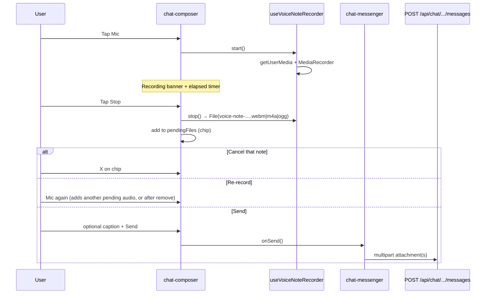

# Voice messaging sending flow

Precise reference for how **voice / audio messages** work on the TAV web app today, and what the mobile app should reuse.

This document covers **two separate products**. Do not treat them as one pipeline.

| Product | Surface | Carrier / Twilio? | Mic recorder on web? |
|---|---|---|---|
| **B — Internal chat voice notes** | `/chat` | No — in-app only (Supabase Storage) | **Yes** (`MediaRecorder`) |
| **A — Inbox MMS audio** | Inbox SMS/MMS composer | **Yes** — customer receives carrier MMS audio | **No** — attach file only |

**Related docs:** outbound image/MMS path → [`image-sending-flow-website.md`](./image-sending-flow-website.md). Real-time **phone calls** (Twilio Voice Device / CallKit) are **out of scope** here — see [`calls-flow.md`](./calls-flow.md) (detailed) and [`flows/08-voice-calls.md`](../flows/08-voice-calls.md) (skeleton).

**Mobile plan:** Phase 11 in [`IMPLEMENTATION_PLAN.md`](../IMPLEMENTATION_PLAN.md).

---

## Product clarification (A / B / C)

**Answer: C — both exist on web; document them separately below.**

| | **B — Chat voice notes** | **A — Inbox MMS audio** |
|---|---|---|
| **Intent** | Staff-to-staff voice notes inside org chat | Send/receive short audio as MMS over the Twilio inbox line |
| **Who sends** | Any **approved** user who is a **member** of that conversation (DM or group; org-wide chat access) | Approved user with **send** access on that inbox (`userCanSendInbox`) |
| **Who receives** | Other conversation members in-app only | Customer phone (carrier MMS) + agents in the inbox thread |
| **1:1 vs groups** | Both DM and group conversations | 1:1 and group threads (same `POST /api/messages/send` as images) |
| **UI entry** | Composer **Mic** button (toggle record/stop) + paperclip can attach audio files | Composer **paperclip / file picker** only (`accept` includes `audio/mpeg`, `audio/mp4`) |
| **Customer sees** | Nothing on their phone — not Twilio | Carrier-delivered audio (MP3/M4A); reliability varies by carrier |

**Primary “voice message” UX on web = B.** Part A is “audio as an MMS attachment,” not a dedicated voice-note recorder.

---

# Part B — Internal chat voice notes (`/chat`)

## Product intent

Record or attach short audio inside **internal chat**. Playback is **in-app only** (signed Storage URLs). No Twilio, no carrier, no SMS/MMS thread.

### Who can send / receive

| Rule | Detail |
|---|---|
| Auth | `getApprovedApiUser()` on all chat message/attachment APIs |
| Membership | Must be a row in `internal_conversation_members` for that conversation (`requireConversationMember`) |
| Scope | Org-wide chat for approved users (not limited to dashboard operators for product access; RLS historically tightened — see migrations under `tools/sql/20260615120000_internal_chat_org_wide_access.sql`) |
| Thread kinds | `direct` and `group` — same attachment path |

### Where it appears in the UI

| Control | Behavior |
|---|---|
| **Mic button** | Click → start recording; click **Stop** (or mic again) → stop and add a pending “Voice note” chip. **Not** hold-to-record. |
| **Paperclip** | File picker; can attach existing audio (`audio/webm`, `audio/mp4`, `audio/mpeg`, `audio/ogg`, …) among other allowed types |
| **Pending chip** | Label “Voice note” + remove (X). No scrubber in the composer chip itself |
| **Send** | Enabled when text and/or pending files exist and not currently recording |
| **Bubble** | Inline `<audio controls>` with mic icon (`ChatVoiceNotes` in `chat-message-bubble.tsx`) |

**Primary UI:** `web/components/chat-composer.tsx`  
**Thread shell:** `web/app/(workspace)/chat/chat-messenger.tsx`  
**Bubble playback:** `web/components/chat-message-bubble.tsx` → `ChatVoiceNotes`

---

## User workflows (chat)

### Record → pending → send / cancel / re-record



| Step | What happens |
|---|---|
| Start | `requestMicrophoneAccess()` then `getUserMedia({ audio: true })`; `MediaRecorder` with preferred MIME |
| During | Red “Recording m:ss” banner; auto-stop at **2 minutes** (`CHAT_VOICE_NOTE_MAX_MS`) |
| Stop | Builds `File` named `voice-note-{timestamp}.{webm\|m4a\|ogg}`; added to `pendingFiles` |
| Cancel | Remove chip (revokes blob URL); does **not** auto-reopen mic |
| Re-record | Start mic again; each stop adds another pending file (up to max attachments) |
| Preview before send | Composer shows chip only. Optimistic bubble after send shows `<audio controls src={blob:…}>` via `voice_preview_urls` |
| Caption | Optional text in the same message (`body`); audio-only allowed |

### Attach an existing audio file

Allowed via paperclip / drag-drop / paste when MIME resolves to an allowed audio type. Same size cap as recorded notes on the **client** (10 MB). Filename does not need to start with `voice-note` for playback; list preview text treats any `audio/*` as a voice message.

### Play inbound / outbound audio in the bubble

- **Optimistic (sender):** `voice_preview_urls` → blob URLs on `<audio controls>`
- **Persisted:** `/api/chat/attachments/{id}/url` → **302** to Supabase signed URL → `<audio controls>`
- Native browser audio controls (play/pause, scrubber, duration) — no custom waveform UI

### Failures

| Failure | Where | User-visible |
|---|---|---|
| Mic permission denied | `requestMicrophoneAccess` / `getUserMedia` | “Microphone access is blocked…” (`getMicrophoneDeniedMessage`) |
| No mic / unsupported | recorder hook | “No microphone found…” / “Voice notes are not supported in this browser.” / “Could not start recording.” |
| Too long | Auto-stop at 2 min; file still produced if under size cap | Timer stops; note added as pending |
| Too large (> 10 MB client) | Recorder `onstop` or composer validate | “Voice notes must be at most 10 MB” |
| Wrong type | Composer / server MIME allowlist | Unsupported file type error |
| Upload / DB fail | `sendChatMessage` rolls back message + Storage objects | Optimistic bubble removed; composer + pending files restored; error string |

---

## Recording & file rules (chat)

| Rule | Value | Source |
|---|---|---|
| Max duration | **2 minutes** (`120_000` ms) | `CHAT_VOICE_NOTE_MAX_MS` |
| Max size (client, audio) | **10 MB** | `CHAT_VOICE_NOTE_MAX_BYTES` |
| Max size (server, any attachment) | **25 MB** | `CHAT_MAX_UPLOAD_BYTES` (server does **not** special-case the 10 MB voice cap) |
| Max files per message | **5** | `CHAT_MAX_ATTACHMENTS_PER_SEND` |
| Max body length | **8000** chars | `normalizeChatMessageBodyOptional` / DB check |
| Empty body | **Allowed** if ≥1 attachment | API + `sendChatMessage` |
| Caption + audio | **Yes** — same message | `body` + `attachment` fields |
| Compression / conversion | **None** — raw `MediaRecorder` / picked file uploaded as-is | — |
| Sample rate | Browser / OS default (not set in app code) | — |

### MIME / format preferences (recorder)

Tried in order (`pickRecorderMimeType`):

1. `audio/webm;codecs=opus`
2. `audio/webm`
3. `audio/mp4`
4. `audio/ogg;codecs=opus`

Filename extension: `.webm` / `.m4a` / `.ogg` from MIME. Stored `content_type` is the MIME **without** codec parameters.

### Allowed audio MIME (chat allowlist)

From `CHAT_ALLOWED_MIME` / `EXT_TO_MIME`:

| MIME | Typical ext |
|---|---|
| `audio/webm` | `.webm` |
| `audio/mp4` | `.m4a` |
| `audio/mpeg` | `.mp3` |
| `audio/ogg` | `.ogg` |
| `audio/x-m4a` | (resolved via type) |

`isChatVoiceNoteFilename`: filename lowercases starts with `voice-note` (used for list preview labeling).

---

## Send path (technical) — chat

```mermaid
sequenceDiagram
  participant UI as chat-messenger
  participant API as POST /api/chat/conversations/:id/messages
  participant Send as sendChatMessage
  participant Stor as Storage bucket internal-chat
  participant DB as internal_messages + internal_message_attachments

  UI->>UI: optimistic message (voice_preview_urls)
  UI->>API: multipart/form-data
  API->>API: auth + member check + validate files
  API->>Send: body + attachment buffers
  Send->>DB: insert internal_messages
  loop each file
    Send->>Stor: upload path conversationId/messageId/…
    Send->>DB: insert internal_message_attachments
  end
  Send-->>API: ChatMessageRow
  API-->>UI: { message }
  UI->>UI: replace optimistic; revoke blob URLs
```

### Endpoint

| Property | Value |
|---|---|
| Method | `POST` |
| Path | `/api/chat/conversations/{conversationId}/messages` |
| Handler | `web/app/api/chat/conversations/[id]/messages/route.ts` |
| Runtime | Node.js (`dynamic = "force-dynamic"`) |

### Payload

#### Multipart (voice notes / any attachments)

| Field | Type | Required | Notes |
|---|---|---|---|
| `body` | string | No* | Trimmed; max 8000 |
| `reply_to_message_id` | UUID string | No | Must be same conversation |
| `attachment` | `File` (repeat) | No* | `form.getAll("attachment")`; field name is **`attachment`** |

\* At least one of non-empty `body` or ≥1 non-empty attachment.

Client pattern (`chat-messenger.tsx`):

```ts
const fd = new FormData();
if (body) fd.set("body", body);
if (replyTo?.id) fd.set("reply_to_message_id", replyTo.id);
for (const pf of files) {
  fd.append("attachment", pf.file);
}
await fetch(`/api/chat/conversations/${selectedId}/messages`, {
  method: "POST",
  credentials: "include",
  body: fd,
});
```

#### JSON (text-only)

```json
{ "body": "…", "reply_to_message_id": null }
```

### How it lands in DB / Storage

| Store | Role |
|---|---|
| `internal_messages` | Row with `body` (may be `''`), `sender_user_id`, optional `reply_to_message_id` |
| `internal_message_attachments` | One row per file: `storage_path`, `filename`, `content_type`, `byte_size`, `sort_order` |
| Bucket **`internal-chat`** (private) | Object at `{conversationId}/{messageId}/{sortOrder}-{hex}-{safeFilename}` |

**Not used:** Twilio MCS, `message_attachments`, Conversations media SIDs.

On attachment failure: uploaded Storage objects deleted; message row deleted; API returns 500 with error string.

Conversation list preview (`last_message_body`): attachment-only voice → `"Voice message"` / `"N Voice messages"` (`chatMessagePreviewText`).

### Optimistic UI

| Field | Behavior |
|---|---|
| Temp id | `optimistic-{clientSendId}` |
| `voice_preview_urls` | Blob URLs for pending audio |
| `attachments` | Empty until server response |
| On success | Replace with server `message` (real attachment ids); revoke blobs |
| On failure | Remove optimistic; restore composer, reply target, and `pendingFiles` |

There is **no** `queued → sent → delivered` pipeline for chat. Persistence is immediate; delivery is “other members see it via Realtime / reload.”

### Status updates

N/A for Twilio-style statuses. Failure is only the HTTP response on send.

---

## Receive / display path — chat

### How audio arrives for the listener

1. Sender’s insert → Realtime `INSERT` on `internal_messages` (open conversation) → message appears (often with `attachments: []` first).
2. Realtime `INSERT` on `internal_message_attachments` → client merges attachment onto the message by `message_id`.
3. Playback URL: `GET /api/chat/attachments/{attachmentId}/url`  
   - Auth + conversation membership  
   - `createInternalChatSignedUrl` — TTL **1 hour** (`INTERNAL_CHAT_SIGNED_URL_TTL_SEC`)  
   - **302** redirect to signed Storage URL  

### Playback UI

Inline `<audio controls>` in the bubble (`ChatVoiceNotes`). Audio is excluded from the image/PDF lightbox gallery (`collectChatAttachmentGallery` skips `kind === "audio"`).

### Realtime

| Event | Effect on open thread |
|---|---|
| `internal_messages` INSERT | Append message (attachments may be empty) |
| `internal_message_attachments` INSERT | Append attachment to matching message (includes audio) |
| Own send | Optimistic then HTTP response (Realtime may also fire; deduped by id) |

**Yes — a new voice message updates the open thread live** (message row, then attachment row).

---

## Permissions & edge cases — chat

| Case | Behavior |
|---|---|
| Not a conversation member | `403` / membership error from API |
| Offline / flaky network | Fetch fails → optimistic rolled back; pending files restored |
| Multiple audio attachments | Allowed up to 5 total attachments; each gets its own `<audio>` in the bubble |
| Mix audio + images/docs | Allowed; preview text falls back to file-count style if not all-voice |
| History-only inbox | **Irrelevant** — chat does not use inbox Twilio numbers |
| Server MIME error string | `validateChatAttachmentFile` error text historically lists images/docs and omits “voice notes,” but **audio MIME is allowed** via `CHAT_ALLOWED_MIME` |

---

## Evidence from web — chat

| Kind | Path |
|---|---|
| Composer + mic | `web/components/chat-composer.tsx` |
| Recorder hook | `web/lib/chat/use-voice-note-recorder.ts` |
| Mic permission helpers | `web/lib/voice/microphone-permission.ts` |
| Constants / MIME | `web/lib/chat/attachment-constants.ts` |
| Client validation | `web/lib/chat/upload-attachment.ts` |
| Send + DB | `web/lib/chat/send-message.ts` |
| Storage | `web/lib/chat/attachment-storage.ts` (`INTERNAL_CHAT_BUCKET = "internal-chat"`) |
| Preview labels | `web/lib/chat/message-preview.ts` |
| Bubble player | `web/components/chat-message-bubble.tsx` (`ChatVoiceNotes`) |
| Thread send + Realtime | `web/app/(workspace)/chat/chat-messenger.tsx` |
| POST messages | `web/app/api/chat/conversations/[id]/messages/route.ts` |
| GET attachment URL | `web/app/api/chat/attachments/[id]/url/route.ts` |
| SQL / bucket | `tools/sql/20260612150000_internal_chat_attachments.sql` (and mirrored `supabase/migrations/…`) |
| Org-wide access | `tools/sql/20260615120000_internal_chat_org_wide_access.sql` |

---

# Part A — Inbox SMS/MMS audio attachments

## Product intent

Agents attach **short audio files** (MP3 / M4A) to an outbound SMS/MMS from the **inbox**. The customer’s phone receives carrier MMS media (when the carrier accepts it). Agents see the attachment in the thread.

This is **not** a voice-note recorder on web today.

### Who can send / receive

| Rule | Detail |
|---|---|
| Auth | `getApprovedApiUser()` |
| Inbox | `userCanSendInbox`; inbox must have `twilio_phone_e164` (not history-only) |
| Recipients | Customer E.164 (1:1) or group thread participants |
| Inbound | Customer can send audio MMS → stored on `message_attachments` and shown in thread |

### Where it appears in the UI

| Control | Behavior |
|---|---|
| File picker / drag / paste | Same MMS attachment UX as images; `accept` includes `audio/mpeg,audio/mp4` |
| Mic / hold-to-record | **None** in inbox |
| Bubble | Non-image attachments render as a **filename link/button**, not an inline `<audio>` player (`MessageMediaAttachments` in `inbox-messenger.tsx`) |

**Primary UI:** `web/app/inbox/inbox-messenger.tsx`  
**Primary API:** `POST /api/messages/send`  
**Full MMS send mechanics:** [`image-sending-flow-website.md`](./image-sending-flow-website.md) (audio uses the same multipart path)

---

## User workflows (inbox audio)

| Workflow | Supported? |
|---|---|
| Record in composer | **No** |
| Attach existing MP3/M4A | **Yes** |
| Caption + audio | **Yes** (`body` optional if attachments present) |
| Audio-only (empty body) | **Yes** |
| Inline play in bubble | **No** — opens via `/api/messages/attachments/{id}/url` (redirect) |
| Cancel pending | Remove from `pendingAttachments` before send |

### Failures

| Failure | Behavior |
|---|---|
| Wrong type | Toast / API 400 — carriers only images + short audio/video (see allowlist) |
| Too large | Client + server: max **4 MB** per file (`MMS_MAX_UPLOAD_BYTES`) |
| Too many files | Max **10** (`MMS_MAX_ATTACHMENTS_PER_SEND`) |
| History-only inbox | API `400`: “This inbox has no live Twilio number (history-only)” |
| Carrier reject after accept | Message status → `failed` / `undelivered`; humanized hints in `mms-delivery-status.ts` (e.g. **30034** media size) |

---

## Recording & file rules (inbox)

| Rule | Value |
|---|---|
| Allowed audio MIME | `audio/mpeg`, `audio/mp4` only (`web/lib/mms/constants.ts`) |
| Extensions (client fallback) | `.mp3`, `.m4a`, `.mpeg`, `.mpg` (via `composerFileAllowed` regex) |
| Max size | **4 MB** / file (under Vercel ~4.5 MB body limit) |
| Max attachments | **10** / message |
| Compression | Images may be compressed client-side; **audio is not converted** |
| `audio/webm` / Ogg from browser recorder | **Rejected** for MMS — not in carrier allowlist |

---

## Send path (technical) — inbox

Same as image MMS:

1. `multipart/form-data` → `POST /api/messages/send`
2. Fields: `inbox_id`, `to` or `thread_id`, `body`, repeated `attachment`
3. Server validates MIME via `isAllowedMmsContentType`
4. Insert `messages` (`queued` …) + upload media via **Twilio Conversations + MCS** (`ME…` SIDs)
5. Insert `message_attachments` (`content_type`, `filename`, `size_bytes`, `twilio_media_sid`, optional `storage_path` / `external_url`)

See [`image-sending-flow-website.md`](./image-sending-flow-website.md) for field-level detail, optimistic UI, and status polling.

### Status updates

`queued` → `sent` / `delivered` / `failed` / `undelivered` (Twilio delivery pipeline). Carrier rejection surfaces as failed status + optional `error_hint`.

---

## Receive / display path — inbox

| Step | Detail |
|---|---|
| Inbound media | Twilio webhook / Conversations → `message_attachments` rows |
| Agent playback URL | `GET /api/messages/attachments/{attachmentId}/url` — prefers Storage signed URL, else `external_url`, else MCS temporary URL for `ME…` SID |
| UI | Filename chip / link (not dedicated voice-note player) |
| Realtime | Same inbox message Realtime as other SMS/MMS (open thread updates when new messages/attachments arrive) |

---

## Permissions & edge cases — inbox

| Case | Behavior |
|---|---|
| History-only inbox | Cannot send (no Twilio number) |
| Offline | Send fetch fails; optimistic handling per inbox messenger |
| Multiple audio files | Allowed within the 10-file cap; each becomes an MMS part / attachment row |
| Carrier rejects audio | Twilio may accept; carrier fails delivery → failed status + codes such as **30018 / 30034 / 30452** (called out in `mms/constants.ts` comments and `mms-delivery-status.ts`) |
| Mixing with images | Allowed; same multipart batch |

---

## Evidence from web — inbox audio

| Kind | Path |
|---|---|
| Composer + accept list | `web/app/inbox/inbox-messenger.tsx` |
| MMS allowlist / limits | `web/lib/mms/constants.ts` |
| Send API | `web/app/api/messages/send/route.ts` |
| Attachment redirect | `web/app/api/messages/attachments/[attachmentId]/url/route.ts` |
| Delivery / carrier hints | `web/lib/messaging/mms-delivery-status.ts` |
| End-to-end MMS reference | `docs/image-sending-flow-website.md` |

---

# Mobile notes (later)

Short guidance so the app can mirror web without inventing a third stack.

## What to reuse as-is

| Layer | Reuse |
|---|---|
| Chat APIs | `POST /api/chat/conversations/:id/messages` multipart (`attachment`), `GET /api/chat/attachments/:id/url` |
| Inbox APIs | `POST /api/messages/send` multipart — same as images; audio MIME `audio/mpeg` / `audio/mp4` only |
| Auth | Same approved-session / Bearer pattern the mobile app already uses for messaging |
| Limits | Match constants above (2 min / 10 MB chat; 4 MB / MP3·M4A inbox) |
| DB / buckets | No new schema required for parity |

## What needs native work

| Concern | Chat voice notes | Inbox MMS audio |
|---|---|---|
| Recorder | **Native** (`expo-av` / `expo-audio` or similar) — do not rely on web `MediaRecorder` | Optional; can ship attach-from-files first |
| Format | Prefer a format chat already allows (`audio/mp4` / `.m4a` is safest cross-platform). Avoid uploading a format only Chrome produces (`webm`) if Android/iOS playback for peers is poor | Must be **`audio/mpeg` or `audio/mp4`** for carriers |
| Playback | Native audio player in bubble (or WebView audio) against the signed redirect URL | Same redirect URL; consider inline player (web does not have one) |
| Permissions | Mic permission prompts (iOS/Android privacy strings) | Files / media library as needed |

## Background / interruptions (chat recorder)

| Topic | Web today | Mobile expectation |
|---|---|---|
| Background recording | Not supported meaningfully (tab must stay active) | Decide product: usually **foreground-only** for v1 |
| Lock screen | N/A | If background allowed, needs native session + OS audio category |
| Incoming phone call / Twilio Voice call | Browser may pause/kill tracks; no special handler | Pause/cancel recording on interruption; do not leave orphan pending files without UX |
| Hold-to-record vs tap | Web = **tap toggle** | Match web unless product explicitly wants press-and-hold |

## Suggested mobile parity order

1. **Inbox:** attach MP3/M4A (and optionally add a recorder that **exports M4A/MP3**, never WebM) via `/api/messages/send` — can ship without internal chat.
2. **Chat baseline** then **chat voice notes:** record → pending → send via existing chat multipart API + inline playback.
3. Defer fancy waveforms, lock-screen recording, and CallKit — those belong to **calling**, not this doc.

---

# Quick comparison

| | Chat voice note | Inbox MMS audio |
|---|---|---|
| Endpoint | `POST /api/chat/conversations/:id/messages` | `POST /api/messages/send` |
| Storage | `internal-chat` bucket | MCS / `message_attachments` (+ optional outbound MMS bucket) |
| Recorder on web | Yes | No |
| Inline `<audio>` on web | Yes | No (link only) |
| Customer phone | Never | Yes (if carrier accepts) |
| Delivery statuses | Immediate persist | `queued` → sent/delivered/failed |
| Max duration | 2 min (recorder) | Not enforced as duration; size ≤ 4 MB |
| Max audio size (client) | 10 MB | 4 MB |
