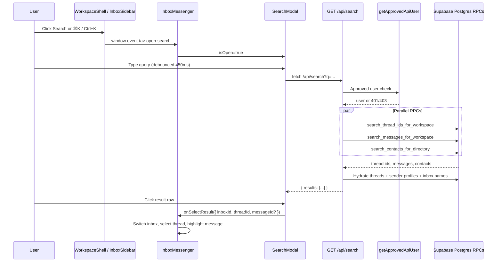

# Search bar flow — TAV Inbox (web)

**Purpose:** End-to-end reference for how global workspace search works in the TAV Inbox web app. Use this document to replicate the same UX, API shape, database search strategy, and post-selection navigation in another project (e.g. a mobile client or a new Next.js app).

**Production app:** https://tav-communication.vercel.app/

**Source of truth (code):**

| Layer | Path |
|-------|------|
| Modal UI | `web/components/search-modal.tsx` |
| Open / keyboard / selection wiring | `web/app/inbox/inbox-messenger.tsx` |
| Sidebar / shell triggers | `web/components/workspace-shell.tsx`, `web/components/inbox-sidebar.tsx` |
| API | `web/app/api/search/route.ts` |
| Auth gate | `web/lib/auth/api-session.ts` (`getApprovedApiUser`) |
| Display helpers | `web/lib/phone/format.ts`, `web/lib/messaging/thread-preview-sender.ts` |
| SQL (thread + message RPCs) | `tools/sql/20260603120000_workspace_search_rpc.sql` |
| SQL (contact RPC + indexes) | Applied in production; definition fetched from Supabase (`search_contacts_for_directory`) |

---

## 1. What search does

Search is a **global, cross-inbox** modal that lets approved org users find:

1. **Threads** by display name, customer phone, or digits-only phone substring
2. **Messages** by body text (substring match)
3. **Contacts** from the org directory — surfaced as threads when a matching `customer_e164` thread exists

When the user picks a result:

- The app switches to the result's **inbox** (if different from the current one)
- Opens the **thread**
- Optionally **scrolls to and briefly highlights** a specific **message** (if the user clicked a message hit)
- Automatically **loads older messages** (paginates backward) until the target message is found or history is exhausted

Search does **not** currently return "compose new message to contact with no thread" rows from the API, although the UI component has rendering code for that case (see §12).

---

## 2. High-level architecture



---

## 3. How the search modal is opened

Search lives inside **`InboxMessenger`** (`web/app/inbox/inbox-messenger.tsx`). The modal is **not** mounted on `/contacts`, `/chat`, etc. — but it can be opened from the sidebar on any workspace route because opening uses a **window CustomEvent**.

### 3.1 Entry points

| Trigger | Location | Behavior |
|---------|----------|----------|
| **Search icon** in inbox header | `inbox-messenger.tsx` | `setSearchOpen(true)` |
| **⌘K / Ctrl+K** (toggle) | `inbox-messenger.tsx` `useEffect` on `keydown` | Toggles modal; **ignored** when focus is in `textarea`, `input`, `select`, or `[contenteditable]` |
| **Sidebar Search button** (expanded rail) | `inbox-sidebar.tsx` → `onOpenSearch` | Dispatched from `workspace-shell.tsx` |
| **Sidebar Search icon** (collapsed rail) | Same as above | |
| **Mobile menu Search** (non-inbox routes) | `workspace-shell.tsx` mobile drawer | `window.dispatchEvent(new CustomEvent("tav-open-search"))` |

### 3.2 Event bridge

`InboxMessenger` listens once on mount:

```typescript
window.addEventListener("tav-open-search", () => setSearchOpen(true));
```

`WorkspaceShell` passes to `InboxSidebar`:

```typescript
onOpenSearch={() => {
  setMobileOpen(false);
  window.dispatchEvent(new CustomEvent("tav-open-search"));
}}
```

**Critical limitation:** `InboxMessenger` (and therefore `SearchModal`) is **only mounted on `/inbox`**. The sidebar and mobile menu dispatch `tav-open-search` from every workspace route, but **nothing listens unless the user is on `/inbox`**. From `/contacts`, `/chat`, etc., clicking Search in the sidebar currently has no effect unless you also navigate to Messages first.

**For replication:** Either (a) lift `SearchModal` into `WorkspaceShell` so it is always mounted, or (b) navigate to `/inbox` before opening search, e.g. `nav.navigate('/inbox'); dispatchEvent(...)`.

### 3.3 Keyboard close

Inside `SearchModal`:

- **Esc** → `onClose()`
- **⌘K / Ctrl+K** while open → `onClose()` (same chord as open, but modal handler runs when open)

Footer hint documents: `Esc` or `⌘K`/`Ctrl+K` to close.

---

## 4. SearchModal UI (`web/components/search-modal.tsx`)

### 4.1 Props

```typescript
type SearchModalProps = {
  isOpen: boolean;
  onClose: () => void;
  onSelectResult: (payload: SearchSelectPayload) => void;
  recentThreads?: SearchModalRecentThread[];  // default []
  recentInboxId?: string | null;
  recentInboxName?: string | null;
  currentUserId?: string;
  currentUserName?: string;
};

type SearchSelectPayload = {
  inboxId: string;
  threadId: string;
  messageId?: string;
};
```

`InboxMessenger` passes:

```typescript
<SearchModal
  isOpen={searchOpen}
  onClose={() => setSearchOpen(false)}
  onSelectResult={handleSearchSelect}
  recentThreads={threads.slice(0, 5)}
  recentInboxId={selectedInboxId}
  recentInboxName={selectedInbox?.display_name ?? null}
  currentUserId={currentUserId}
  currentUserName={userName}
/>
```

`threads` here is the **filtered thread list for the current inbox** (active/unread/archived filter applied), not global.

### 4.2 Local state

| State | Type | Purpose |
|-------|------|---------|
| `query` | `string` | Input value |
| `results` | `SearchResultRow[]` | Normalized API results |
| `loading` | `boolean` | Fetch in progress |

When `isOpen` becomes `false`, `query` and `results` are cleared.

### 4.3 Debounced fetch

```typescript
useEffect(() => {
  const timer = setTimeout(() => {
    void performSearch(query);
  }, 450);
  return () => clearTimeout(timer);
}, [query, performSearch]);
```

**Debounce:** 450 ms after last keystroke.

### 4.4 Minimum query length (UI vs API)

| Layer | Minimum | Notes |
|-------|---------|-------|
| **`performSearch` (client)** | **3 characters** (trimmed) | Clears results if `< 3` |
| **`GET /api/search` (server)** | **3 characters** (trimmed) | Returns `{ results: [] }` if `< 3` |
| **Postgres RPCs** | **3 characters** | Early return if `< 3` |
| **UI empty / skeleton copy** | Says **"2 characters"** | **Copy is stale** — actual behavior is 3 |

When implementing elsewhere, standardize on **3 characters** everywhere (matches pg_trgm index usage intent; see commit `c9bd411`).

### 4.5 API call

```typescript
const params = new URLSearchParams({ q: searchQuery });
const res = await fetch(`/api/search?${params}`);
const data = await res.json();
const raw = data.results ?? [];
```

No `POST` body. Cookies carry the Supabase session (browser). Native clients would send `Authorization: Bearer <access_token>` — the API auth layer supports both (`api-session.ts`).

### 4.6 Response normalization

Each row is mapped to one of:

**Thread hit**

```typescript
{
  kind: "thread",
  thread: { id, inbox_id, customer_e164, thread_kind, thread_participants, display_name, contact_id, contacts, last_message_at },
  matchedMessages: [{ id, body, created_at, direction, sent_by, sender_profile? }],
  subtitle?: string | null,        // e.g. "Contact directory"
  inbox_display_name: string | null
}
```

**Compose hit** (UI-only today — see §12)

```typescript
{
  kind: "compose",
  inbox_id: string,
  to: string,                      // E.164
  display_name: string | null,
  inbox_display_name: string | null
}
```

Rows without `thread.id` (and not compose) are filtered out.

### 4.7 Empty-query UX ("Recent in this inbox")

When `query.trim().length < 3` and not loading:

- If `recentThreads.length > 0`: show up to **5** recent threads from the **current inbox** with last-message preview
- Each row calls `handleSelectThread(recentInboxId, thread.id)` — **no message highlight**
- Footer text prompts user to type to search **all inboxes**

If no recent threads: centered hint to type at least N characters.

### 4.8 Loading UX

Skeleton shows when:

```typescript
loading && query.trim().length >= 2
```

Again, fetch only runs at 3+ chars — so skeleton may appear for the 3rd character during debounce.

### 4.9 Result rendering rules

For each result row:

| Case | UI |
|------|-----|
| `kind === "compose"` | Avatar + name/phone + badge "New message — matches Contacts (no thread yet)" → navigates to `/inbox?inbox=…&compose=1&to=…` |
| Thread with `matchedMessages.length > 0` | **One button per matched message** (max 5 from API). Shows message body or `(attachment)` if blank. Prefix with outbound sender name when applicable. |
| Thread with no matched messages | Single row; subtitle shown if present (e.g. "Contact directory") |

**Inbox badge:** Small gray pill with `inbox_display_name` so cross-inbox hits are identifiable.

**Thread title priority** (`getThreadDisplayName` in `web/lib/phone/format.ts`):

1. `thread.display_name`
2. Linked `contacts.display_name`
3. Group: formatted participant phones (`app_group` / `group_mms`)
4. `customer_e164` formatted as US phone
5. Fallback `"Group chat"`

**Avatar seed:** For groups, joined participant E.164s; else `customer_e164` or thread `id`.

### 4.10 Selection handlers

**Thread / message:**

```typescript
onSelectResult({ inboxId, threadId, messageId });
onClose();
```

**Compose (if ever returned by API):**

```typescript
router.push(`/inbox?inbox=${encodeURIComponent(hit.inbox_id)}&compose=1&to=${encodeURIComponent(hit.to)}`);
onClose();
```

---

## 5. Post-selection flow (`handleSearchSelect` in `inbox-messenger.tsx`)

This is the most important behavior to replicate for parity.

### 5.1 Input

```typescript
function handleSearchSelect({ inboxId, threadId, messageId }: SearchSelectPayload)
```

### 5.2 Resolve inbox

```typescript
const resolvedInboxId = inboxId.trim() || selectedInboxIdRef.current || "";
if (!resolvedInboxId) return;
```

### 5.3 Adjust thread list filter tab

Looks up the thread in `threadsByInboxRef` and switches list filter:

- Archived thread → `"archived"`
- Unread (non-archived) → `"unread"`
- Otherwise → `"active"`

So the selected thread is visible in the left thread list after navigation.

### 5.4 Message highlight intent

```typescript
if (messageId) {
  pendingHighlightMessageIdRef.current = messageId;
  stickToBottomRef.current = false;   // don't auto-scroll to latest
} else {
  pendingHighlightMessageIdRef.current = null;
  stickToBottomRef.current = true;    // normal "open thread" behavior
}
```

### 5.5 Cross-inbox switch

If `resolvedInboxId !== selectedInboxIdRef.current`:

1. Abort in-flight thread prefetch (`threadsPrefetchAbortGenRef`)
2. `setRailInboxIdOverride(resolvedInboxId)` — keeps sidebar in sync before URL updates
3. `setSelectedInboxId(resolvedInboxId)`
4. Clear messages, draft compose state
5. `scheduleInboxUrlSync(resolvedInboxId)` — updates `?inbox=` in URL
6. Load threads for new inbox (silent refresh if cached, full load if not)

### 5.6 Select thread

```typescript
selectThread(threadId);
```

`selectThread` sets `selectedThreadId`, marks read, resets side panel, etc.

### 5.7 Message highlight + backward pagination

A dedicated `useEffect` watches `selectedThreadId`, `loadingMessages`, `loadingOlder`, and `messages.length`.

Algorithm:

1. Read `pendingHighlightMessageIdRef.current`
2. If no pending id, or thread is `"new"`, or still loading initial messages → wait
3. Increment `searchHighlightRunRef` (cancellation token)
4. **Loop** (max **24** attempts):
   - If message id exists in `messagesRef.current` → break
   - If thread has no more older messages on server → break
   - If message cache says `hasMoreOlder === false` → break
   - Call `loadOlderMessages()` (client Supabase query, page size `INBOX_MESSAGE_PAGE_SIZE`)
   - Retry
5. If found → `scrollToAndHighlightMessage(messageId)`
6. Clear `pendingHighlightMessageIdRef`

**`scrollToAndHighlightMessage`:**

- Finds index in message list
- Sets `highlightMessageId` state (2.2s flash)
- If virtualized (≥ `INBOX_MESSAGE_VIRTUALIZE_THRESHOLD`, default 48): `virtualizer.scrollToIndex(idx, { align: "center" })`
- Else: `querySelector([data-message-id="…"]).scrollIntoView({ block: "center", behavior: "smooth" })`
- CSS class `animate-search-highlight` on message block (blue ring fade — `globals.css`)

### 5.8 Compose deep link (related path)

If user lands via compose URL (`/inbox?compose=1&to=+1…`), `inbox/page.tsx` passes `initialComposeTo` to `InboxMessenger`, which:

- Sets `selectedThreadId` to `"new"`
- Prefills `draftNewTo`
- Clears composer

Search modal's compose handler targets the same URL shape.

---

## 6. API route — `GET /api/search` (`web/app/api/search/route.ts`)

### 6.1 Request

```
GET /api/search?q=<query>
```

| Param | Rules |
|-------|-------|
| `q` | Required for results; trimmed; **max 100 chars**; **min 3 chars** or `{ results: [] }` |

### 6.2 Authentication

```typescript
const gate = await getApprovedApiUser();
if (!gate.ok) return gate.response;
```

`getApprovedApiUser` (React `cache()` wrapped):

1. Resolve user from cookies **or** `Authorization: Bearer <jwt>`
2. Require allowed org email domain
3. Require `profiles.approval_status === 'approved'`

Returns `401` / `403` on failure.

Uses user-scoped Supabase client (`createClient()` from `@/lib/supabase/server`) so RPCs see `auth.uid()`.

### 6.3 Parallel search (3 RPCs)

All three run in `Promise.all`:

| RPC | Limit param | Purpose |
|-----|-------------|---------|
| `search_thread_ids_for_workspace` | `p_limit: 30` | Thread metadata / phone matches |
| `search_messages_for_workspace` | `p_limit: 40` | Message body matches |
| `search_contacts_for_directory` | `p_limit: 25` | Org contact directory |

On any RPC error → `500 { error: "Search failed" }`.

### 6.4 Merge thread IDs

```typescript
const threadIds = new Set([
  ...threadIdRows.map(r => r.id),
  ...messageMatches.map(m => m.thread_id),
]);
```

### 6.5 Enrich message hits with sender profiles

First RPC returns messages without joined profiles. API then:

```typescript
supabase.from("messages")
  .select("id, thread_id, body, created_at, direction, sent_by, sender_profile:profiles!messages_sent_by_fkey ( id, display_name )")
  .in("id", messageIds);
```

Maps back onto matches by id.

### 6.6 Hydrate threads

Single query for all thread ids:

```typescript
const THREAD_LIST_SELECT =
  "id, inbox_id, customer_e164, thread_kind, thread_participants ( participant_e164 ), group_participant_snapshot, display_name, contact_id, contacts ( display_name ), last_message_at";

supabase.from("threads").select(THREAD_LIST_SELECT).in("id", threadIdList);
```

Build `Map<threadId, ThreadSearchHit>`:

- `matchedMessages`: up to **5** messages per thread (filtered from enriched message list)
- `subtitle`: null initially

### 6.7 Contact directory enrichment

From contact RPC, collect unique `phone_e164` values.

```typescript
supabase.from("threads")
  .select(THREAD_LIST_SELECT)
  .in("customer_e164", contactPhones)
  .order("last_message_at", { ascending: false, nullsFirst: false })
  .limit(50);
```

For each contact-linked thread:

- If thread already in map with no messages and no subtitle → set `subtitle: "Contact directory"`
- If thread not in map → add with empty `matchedMessages`, `subtitle: "Contact directory"`

**Gap:** Contacts with **no existing thread** are not returned (compose rows not built).

### 6.8 Sort and cap

```typescript
threadResults.sort((a, b) => threadTime(b.thread) - threadTime(a.thread));
results = threadResults.slice(0, 50);
```

`threadTime` = `last_message_at` ms, or 0 if null.

### 6.9 Attach inbox display names

```typescript
supabase.from("inboxes").select("id, display_name").in("id", inboxIds);
```

Each result gets `inbox_display_name`.

### 6.10 Response shape

```json
{
  "results": [
    {
      "kind": "thread",
      "thread": { "id": "…", "inbox_id": "…", "customer_e164": "+1…", "display_name": null, "last_message_at": "…", … },
      "matchedMessages": [
        { "id": "…", "body": "…", "created_at": "…", "direction": "inbound", "sent_by": null, "sender_profile": null }
      ],
      "subtitle": null,
      "inbox_display_name": "Transportation QA"
    }
  ]
}
```

---

## 7. Database layer

### 7.1 Access control helpers

All search RPCs call `user_has_approved_access()` first. Thread/message RPCs also filter with `user_can_access_inbox(t.inbox_id)`.

**`user_has_approved_access()`**

```sql
SELECT EXISTS (
  SELECT 1 FROM public.profiles p
  WHERE p.id = (SELECT auth.uid())
    AND p.approval_status = 'approved'
);
```

**`user_can_access_inbox(p_inbox_id uuid)`**

```sql
SELECT
  public.is_dev_console_operator()
  OR (
    (SELECT auth.uid()) IS NOT NULL
    AND public.user_has_approved_access()
    AND EXISTS (
      SELECT 1 FROM public.inbox_members m
      WHERE m.user_id = (SELECT auth.uid())
        AND m.inbox_id = p_inbox_id
    )
  );
```

**Implication:** Search only returns threads in inboxes the user is a member of (unless dev-console operator). Cross-inbox means **all permitted inboxes**, not every inbox in the org.

### 7.2 `search_messages_for_workspace(p_query, p_limit)`

- **Security:** `SECURITY DEFINER`, `STABLE`
- **Min query:** 3 chars after trim (max 100)
- **Limit:** clamped 1–40 (default 40)
- **Pattern:** `%query%` with `%`, `_`, `\` escaped for `ILIKE … ESCAPE '\'`
- **Join:** `messages m` ⋈ `threads t` on `thread_id`
- **Filter:** `user_can_access_inbox(t.inbox_id)`, `m.body IS NOT NULL`, `m.body ILIKE pattern`
- **Order:** `m.created_at DESC`

### 7.3 `search_thread_ids_for_workspace(p_query, p_limit)`

- **Limit:** clamped 1–30 (default 30)
- **Matches any of:**
  - `display_name ILIKE pattern`
  - `customer_e164 ILIKE pattern`
  - Digits-only: if ≥3 digits extracted from query, `regexp_replace(customer_e164, '[^0-9]', '', 'g') LIKE '%digits%'`
- **Order:** `last_message_at DESC NULLS LAST`

### 7.4 `search_contacts_for_directory(p_query, p_limit)`

- **Limit:** clamped 1–500 (search API passes **25**)
- **Matches any of:**
  - `search_document ILIKE pattern` (GIN trgm index)
  - Digits-only phone substring (≥3 digits) on `phone_e164`
- **Order:** display-name prefix match first, then contains, then phone
- **RLS:** org-wide contacts for approved users (no inbox filter on contact row)

Full function lives in production Supabase; directory browse uses the same RPC with higher limits (`web/lib/contacts/directory-query.ts`).

### 7.5 Indexes (production)

| Index | Table | Definition |
|-------|-------|------------|
| `idx_messages_body_trgm` | `messages` | GIN on `body gin_trgm_ops` |
| `idx_threads_display_name_trgm` | `threads` | GIN on `display_name gin_trgm_ops` |
| `idx_threads_customer_e164` | `threads` | B-tree on `customer_e164` |
| `contacts_search_document_gin_trgm` | `contacts` | GIN on `search_document gin_trgm_ops` |
| `messages_thread_created_at_idx` | `messages` | B-tree `(thread_id, created_at)` — used when loading older messages after search |

**Design note:** The 3-character minimum aligns with pg_trgm index usability (see `c9bd411 perf(search): require 3+ chars so trigram indexes are always used`).

### 7.6 Grants

```sql
GRANT EXECUTE ON FUNCTION public.search_messages_for_workspace(text, integer) TO authenticated;
GRANT EXECUTE ON FUNCTION public.search_thread_ids_for_workspace(text, integer) TO authenticated;
-- search_contacts_for_directory: authenticated (via directory migration)
```

---

## 8. Display helpers (shared with thread list)

### 8.1 Outbound preview prefixes

Search result subtitles prefix outbound text with sender name:

- **`threadOutboundPreviewPrefix`** — for recent-thread empty state (uses `last_message_sent_by` / embedded sender)
- **`messageOutboundPreviewPrefix`** — for message hits (uses `sender_profile` join)

Both skip prefix for inbound messages.

### 8.2 Phone formatting

`formatPhoneNumber(e164)` → US `(469) 557-5309` for +1 11-digit numbers.

---

## 9. Limits summary

| Stage | Limit |
|-------|-------|
| Query string (client + server + SQL) | 100 chars |
| Min query length | 3 chars |
| Thread ID RPC | 30 |
| Message RPC | 40 |
| Contact RPC (in search API) | 25 |
| Contact→thread lookup | 50 threads |
| Matched messages per thread in response | 5 |
| Total thread results returned | 50 |
| Recent threads (empty query) | 5 |
| Search debounce | 450 ms |
| Highlight flash duration | 2200 ms |
| Max older-message load attempts for highlight | 24 pages |

---

## 10. UI structure (for visual parity)

Modal layout (`search-modal.tsx`):

```
┌─────────────────────────────────────────────┐
│ [🔍]  Search all inboxes — …        [×]    │  ← zinc-50 header, border-b
├─────────────────────────────────────────────┤
│  (scroll max-h: min(24rem, 50vh))           │
│  • Skeleton rows OR                         │
│  • Recent threads OR                        │
│  • Result rows (avatar | title + badge      │
│    | preview line)                          │
├─────────────────────────────────────────────┤
│ Esc or ⌘K/Ctrl+K to close · Click row…     │  ← zinc-50 footer
└─────────────────────────────────────────────┘
Overlay: fixed inset-0, z-index 100, bg-black/60, backdrop-blur
Dialog: max-w-xl, rounded-2xl, shadow-2xl
```

Animations: `animate-fade-in` (overlay), `animate-scale-in` (dialog) — defined in `web/app/globals.css`.

---

## 11. Step-by-step replication checklist

Use this when implementing the same flow in another project.

### Phase A — Database

- [ ] Enable `pg_trgm` extension
- [ ] Add GIN indexes on `messages.body`, `threads.display_name`, `contacts.search_document`
- [ ] Create `user_has_approved_access()` and `user_can_access_inbox(uuid)`
- [ ] Create three RPCs (copy from §7.2–7.4 and `tools/sql/20260603120000_workspace_search_rpc.sql`)
- [ ] Grant `EXECUTE` to `authenticated`

### Phase B — API

- [ ] `GET /api/search?q=` with approved-user gate
- [ ] Trim query, min 3 / max 100 chars
- [ ] Run 3 RPCs in parallel
- [ ] Merge thread ids; enrich messages with sender profiles
- [ ] Hydrate threads with contact embed + participants
- [ ] Merge contact hits into thread map with subtitle
- [ ] Sort by `last_message_at`, cap at 50
- [ ] Attach inbox display names

### Phase C — Client modal

- [ ] Fixed overlay modal with autofocus input
- [ ] 450 ms debounce
- [ ] Fetch `/api/search?q=…`, normalize results
- [ ] Empty state: recent threads (optional)
- [ ] Render thread rows; expand message matches to one row each
- [ ] Inbox badge on every row
- [ ] Esc / ⌘K to close

### Phase D — Selection / navigation

- [ ] Accept `{ inboxId, threadId, messageId? }`
- [ ] Switch inbox if needed (URL + sidebar sync)
- [ ] Adjust list filter (active/unread/archived)
- [ ] Select thread; disable stick-to-bottom when highlighting
- [ ] Paginate older messages until target found (with attempt cap)
- [ ] Scroll to message + temporary highlight animation

### Phase E — Global open

- [ ] ⌘K / Ctrl+K toggle (skip when typing in inputs)
- [ ] Sidebar / mobile menu dispatch `tav-open-search` (or equivalent)
- [ ] Inbox header search button

---

## 12. Known gaps and inconsistencies

| Item | Detail |
|------|--------|
| **Compose results** | `SearchModal` renders `kind: "compose"`, but **`GET /api/search` never returns compose rows**. Contacts without an existing thread do not appear in search results. |
| **UI copy vs behavior** | UI says "2 characters"; API/SQL require **3**. |
| **Loading skeleton threshold** | Shows at 2+ chars; fetch requires 3+. |
| **Scaling doc drift** | `docs/planning/SCALING_AND_CAPACITY_PASS.md` §2.4 lists older limits (20/30 threads/messages); live code uses 30/40/25 and RPC-based search. |
| **Search modal scope** | Modal mounts only on `/inbox`. Sidebar/mobile `tav-open-search` does nothing on other routes (no listener). **Fix for new projects:** mount modal in workspace layout. |

---

## 13. File map (quick reference)

```
web/
├── components/
│   ├── search-modal.tsx          # Modal UI + debounced fetch + result list
│   ├── workspace-shell.tsx       # Dispatches tav-open-search from sidebar/mobile
│   └── inbox-sidebar.tsx         # Search buttons in rail
├── app/
│   ├── inbox/inbox-messenger.tsx # searchOpen state, handleSearchSelect, highlight logic
│   ├── (workspace)/inbox/page.tsx # SSR inbox + compose=1&to= deep links
│   └── api/search/route.ts       # Search API
├── lib/
│   ├── auth/api-session.ts       # getApprovedApiUser
│   ├── phone/format.ts           # getThreadDisplayName, formatPhoneNumber
│   ├── messaging/thread-preview-sender.ts  # Preview prefixes
│   └── contacts/directory-query.ts         # Same contact RPC, higher limits for /contacts
tools/sql/
└── 20260603120000_workspace_search_rpc.sql # Thread + message RPC definitions
```

---

## 14. Example walkthrough

1. User on **`/inbox`** clicks **Search** in sidebar (or presses ⌘K).
2. `tav-open-search` fires; `InboxMessenger` opens the modal.
   - From `/contacts` or other routes, sidebar Search currently **does not open the modal** (see §3.2).
3. User types `"johnson"` (≥3 chars).
4. After 450 ms, `GET /api/search?q=johnson`.
5. RPCs return: 2 threads named Johnson, 5 messages containing "johnson", 3 contacts.
6. API merges into ~4 unique threads, sorted by recency, with up to 5 message lines each.
7. User clicks a message hit from inbox "Sales".
8. `handleSearchSelect` switches inbox to Sales, selects thread, sets pending message id.
9. Messages load; if hit is old, `loadOlderMessages` runs up to 24 times.
10. Message scrolls to center, blue highlight fades over 2.2s.

---

*Generated from TAV-Twilio `master` @ 2026-08-10. Align query-length copy and compose hits if you want strict parity with intended (vs current) behavior.*
