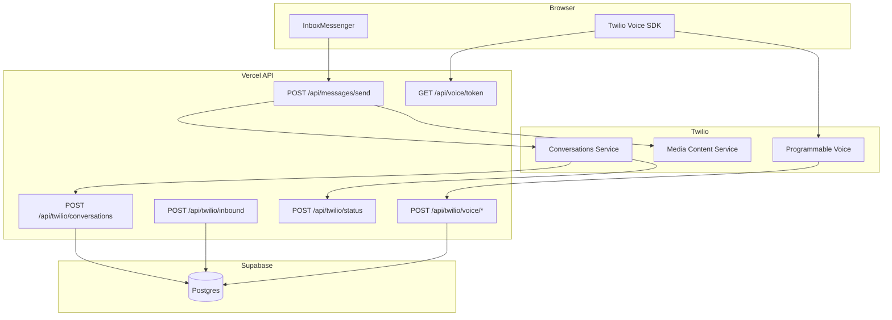

# Twilio integration map

How TAV Communication uses Twilio for SMS, MMS, and voice. All Twilio secrets stay **server-side** (Vercel env vars). Clients never hold Auth Token.

**Production webhooks base:** `https://tav-communication.vercel.app`

---

## Environment variables

From `web/.env.example`:

| Variable | Purpose |
|----------|---------|
| `TWILIO_ACCOUNT_SID` | Account identifier |
| `TWILIO_AUTH_TOKEN` | Webhook signature validation, REST API |
| `TWILIO_CONVERSATIONS_SERVICE_SID` | **Required** — starts with `IS` (not `MG` or `CH`) |
| `TWILIO_API_KEY_SID` / `TWILIO_API_KEY_SECRET` | Voice access tokens |
| `TWILIO_TWIML_APP_SID` | Browser outbound TwiML app (`AP…`) |
| `TWILIO_MCS_URL` | Optional Media Content Service base (default US1) |
| `TWILIO_WEBHOOK_PUBLIC_URL` | Override public origin when signature validation fails behind proxy |
| `TWILIO_SYNC_DAYS` | History backfill window (default 90) for cron/script |

---

## Product split

| Twilio product | Used for |
|----------------|----------|
| **Conversations** | All UI outbound SMS/MMS; primary inbound after May 2026 reset |
| **Programmable Messaging (classic)** | Legacy inbound webhook; status callbacks for SM SIDs |
| **Media Content Service (MCS)** | Outbound MMS upload; signed media URLs |
| **Programmable Voice** | Browser calling (Twilio Voice SDK) |
| **TwiML Apps** | Outbound browser call routing |

Internal **staff chat** (`/chat`) does **not** use Twilio.

---

## Outbound SMS/MMS (primary path)

```
User sends in InboxMessenger
  → POST /api/messages/send
    → getApprovedApiUser + userCanSendInbox
    → 1:1: sendDirect1To1ViaConversations()
         ensureConversationForSmsThread + sendConversationSmsMessage
    → group: executeOutboundToExistingGroupThread()
         group_mms: single native Conversation
         app_group: fan-out — one Conversation per participant
    → MMS: uploadMediaToMcs → twilio_media_sid on message_attachments
    → Multi-image: separate message row per image (carrier fallback)
```

**Key libs:**

- `web/lib/messaging/send-direct-1to1-via-conversations.ts`
- `web/lib/messaging/send-group-thread-outbound.ts`
- `web/lib/twilio/conversations-messaging.ts`
- `web/lib/twilio/mcs-client.ts`

**Legacy (not used by send API on master):** `send-direct-1to1-sms.ts` — direct `messages.create`.

**Zapier:** `POST /api/integrations/zapier/messages` uses same send libraries.

---

## Inbound messaging

### Conversations webhook (primary)

**Route:** `POST /api/twilio/conversations`  
**Auth:** `X-Twilio-Signature` validated via `parseAndValidateTwilioWebhook`

**Events:**

| Event | Handler |
|-------|---------|
| `onMessageAdded` | Skip if author is inbox number. Match thread by `twilio_conversation_sid` or participant. Create thread if needed via `upsert_direct_thread` / `upsert_group_mms_thread`. Insert `messages` with `source: twilio_conversations_webhook`. Upsert contact. Store attachments with `twilio_media_sid`. |
| `onDeliveryUpdated` | Update `messages.status` or `message_fanout_deliveries.status` |

### Classic SMS webhook (still active)

**Route:** `POST /api/twilio/inbound`

Maps `To` → inbox, resolves thread via `resolveInboundThreadForCustomer` (most recently active if phone in multiple threads), inserts message with `source: twilio_webhook`, attachments from `MediaUrl0…` as `external_url`.

### Status callbacks

**Route:** `POST /api/twilio/status`

Updates by `twilio_message_sid` or `twilio_channel_message_sid`. Stores Twilio error codes in `raw_payload` on failure. Orphan callbacks retried after 280ms then logged.

**Console config:** Status callback URL → `{origin}/api/twilio/status`

---

## Conversations vs classic SMS

| Aspect | Conversations (current) | Classic SMS |
|--------|-------------------------|-------------|
| Outbound UI | Always Conversations | N/A |
| Inbound | `onMessageAdded` | POST to `/inbound` |
| Thread link | `threads.twilio_conversation_sid` | Often null on classic inbound |
| Message SID | IM… (conversation) | SM… (SMS) |
| Group MMS | Native or app_group fan-out | N/A |
| Delivery status | `onDeliveryUpdated` + `/status` fallback | `/status` |

**Misconfiguration:** Using `MG…` (Messaging Service) or `CH…` instead of `IS…` for Conversations Service SID produces detailed 500 errors in send path.

---

## Group messaging models

| Kind | Twilio model | Limits |
|------|--------------|--------|
| **direct** | 1 Conversation | 1 external E.164 |
| **app_group** | 1 Conversation **per participant** | 2–20 participants, any E.164 |
| **group_mms** | 1 native Group MMS Conversation | 2–9 external, **+1 NANP only** |

Fan-out partial failures surface Twilio error codes 50407/50435 in API `error_hint`.

---

## Attachments and media

| Direction | Storage |
|-----------|---------|
| Outbound MMS | MCS upload → `message_attachments.twilio_media_sid`; optional Supabase Storage |
| Inbound (Conversations) | `ME…` SID |
| Inbound (classic) | `external_url` (Twilio MediaUrl) |

**Display:** `GET /api/messages/attachments/[id]/url` → 302 to MCS signed URL, Supabase signed URL, or external URL.

**MMS constraints:** Max 10 files, 5 MB each, carrier-safe types only (images, short A/V — no PDFs). See `web/lib/mms/constants.ts`.

---

## Voice (Programmable Voice)

### Browser SDK flow

1. Client: `GET /api/voice/token` → Twilio Voice access token (approved user)
2. Outbound: `POST /api/voice/outbound` → validates inbox send access, returns `connectParams`
3. Twilio calls `POST /api/twilio/voice/outbound-twiml` for TwiML
4. On accept: `POST /api/voice/answered` → sets `call_logs.agent_user_id`

### Inbound browser ringing (pilot)

**Pilot inbox:** Transportation QA — slug `transportation-qa`, E.164 `+17435000019`

| Route | Purpose |
|-------|---------|
| `POST /api/twilio/voice/inbound` | Initial inbound TwiML — dial assigned agents |
| `POST /api/twilio/voice/inbound-dial-complete` | Dial result callback |
| `POST /api/twilio/voice/status` | Call status updates → `call_logs` |

**Ring targets:** `inbox_call_assignments` table, managed via dev console **Call routing** (`PUT /api/dev-console/voice-pilot/call-assignments`). Only approved Transportation QA inbox members can be assigned.

**UI:** `incoming-voice-call-modal`, `thread-voice-call-controls` on 1:1 inbox threads.

**Scope note:** `/calls` history shows **all** voice-enabled lines. Ring assignment and missed-count badge logic are pilot-focused but missed count includes all inbound missed/no-answer across lines.

### Voice env requirements

- `TWILIO_API_KEY_SID`, `TWILIO_API_KEY_SECRET`
- `TWILIO_TWIML_APP_SID` with Voice Request URL → `{origin}/api/twilio/voice/outbound-twiml`

---

## Webhook security

All Twilio POST handlers use:

- `web/lib/twilio/parse-webhook-post.ts` — signature validation against raw body
- `web/lib/twilio/webhook-url.ts` — `buildTwilioWebhookUrl` (respects `TWILIO_WEBHOOK_PUBLIC_URL`)

Invalid signature → rejected request.

---

## History sync (cron)

**Route:** `GET /api/cron/sync-twilio-history`  
**Auth:** `CRON_SECRET` via Bearer, query `secret`, or `x-cron-secret`

Backfills threads/messages from Twilio REST for configured numbers. Also available as CLI: `npm run sync-twilio-history` from `web/`.

---

## Twilio diagnostics (operator)

**Route:** `GET /api/admin/dashboard/messages/twilio-diag`  
Requires `conversationSid` or `dbMessageId`. Used from dev console message detail panel.

---

## Integration diagram



---

## Edge cases

| Case | Behavior |
|------|----------|
| History-only inbox | No `twilio_phone_e164` — UI blocks send |
| VoIP numbers in group_mms | Often fail with 50407; UI hints suggest app_group |
| Same customer in 1:1 + group | Inbound to most recently active thread |
| Duplicate webhook delivery | Unique SID constraint — idempotent 200 |
| Wrong Conversations SID env | Explicit error distinguishing MG/CH vs IS |
| Concurrent inbound voice calls | Second call rejected if one active |
| Outbound voice | Direct 1:1 threads only; inbox must have Twilio number |

---

## Related documents

- [02-inbox-and-direct-messaging.md](../flows/02-inbox-and-direct-messaging.md)
- [03-group-messaging.md](../flows/03-group-messaging.md)
- [08-voice-calls.md](../flows/08-voice-calls.md)
- [data-model.md](./data-model.md)
